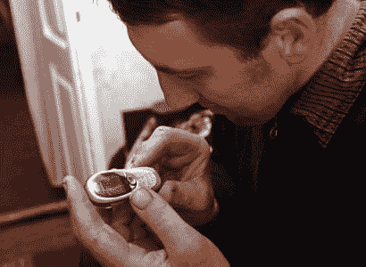

# CrunchImage:世界上最高的人矮化了微型手机

> 原文：<https://web.archive.org/web/http://techcrunch.com/2007/08/08/crunchimage-worlds-tallest-man-dwarves-tiny-cellphone/>

你觉得在手机键盘上打字很难吗？尝试以 Leonid Stadnyk 的身份打电话。

世界上最高的人是 8 英尺 5.5 英寸。那是高的。非常非常高。他住在乌克兰，是一名动物外科医生。酷毙了。

但是看看他用手机有多难。可怜的家伙。有人让他把 12 部 iPhone 连在一起，每个都是一个数字。那会有用的。

[乌克兰兽医宣布世界上最高的人](https://web.archive.org/web/20150930111637/http://www.breitbart.com/article.php?id=070808171935.fgco6x6s&show_article=1)【布莱巴特，图片来自[英俄](https://web.archive.org/web/20150930111637/http://englishrussia.com/?p=1212#more-1212)