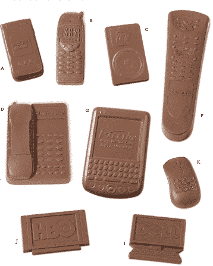

# 克朗彻午餐:巧克力小玩意

> 原文：<https://web.archive.org/web/http://techcrunch.com/2007/04/16/crunchlunch-chocolate-gadget-goodness/>

# 嘎吱嘎吱的午餐:巧克力小玩意

我们都喜欢得到最新最好的电子产品。我的意思是谁不喜欢拆箱一个全新的黑莓 8800 或高清电视？几乎可以说，让这些东西变得更甜的唯一方法就是把它们变成……巧克力！是的，多亏了“公司礼品展示柜”和它可爱的定制巧克力模具系列，你现在可以用一只手吃着固体的牛奶巧克力黑莓，用另一只手吃着黏糊糊的融化的 iPod。

但是要小心，你最终可能会为巧克力支付比它所基于的实际电子产品更多的钱。订单数量为 100 到 1000 个或更多，2 盎司巧克力手机的价格约为 3.10 美元。这显然只适合最胖最饿最富有的极客~~。~~

 ~~[官方网站](https://web.archive.org/web/20210225030933/http://www.corporategiftshowcase.com/CIchocolatetechnology.asp)~~