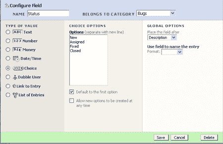
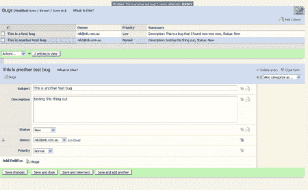
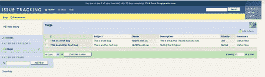

# DabbleDB:面向所有人的在线应用构建——TechCrunch

> 原文：<https://web.archive.org/web/http://www.techcrunch.com:80/2006/03/11/dabbledb-online-app-building-for-everyone/>

时常有人问我‘最新的热门应用是什么’，在使用了 [DabbleDB](https://web.archive.org/web/20220816012635/http://www.dabbledb.com/) 之后，我对这个问题有了新的答案。DabbleDB 是一个允许你使用 web 界面在线创建应用程序的平台。您将创建并使用的应用程序类型是我们大多数人通常在电子表格中或使用其他一些通常很复杂的数据库应用程序时一起创建的。我在 DabbleDB 中创建的示例应用程序是一个联系人列表，我可以在其中存储、共享和分类我的联系人，还有一个问题跟踪系统，我可以在其中跟踪 bug 和更改请求。DabbleDB 网站上的其他例子有费用报告应用程序、会议组织应用程序、日程安排应用程序和客户发票应用程序。

我花了 5 分钟来创建我构建的每个应用程序，界面直观，使用简单。一旦我创建了一个应用程序，我就可以邀请具有不同权限级别(读、写或构建)的其他用户来输入和/或修改数据，或者进一步定制应用程序。创建应用程序时，有许多默认的字段类型可供我选择，比如文本框、日历选择、URL、下拉选择、到另一个用户的链接等等。在构建过程中，我从来不需要三思，我在脑海中想象我需要什么，几分钟后它就出现在屏幕上，我正在添加条目。应用程序的构建过程是完美的，不能再简单了，如果我意识到在添加几个条目后，我需要另一个字段，我只需点击“添加字段”，我很快选择我想要的，它就在那里。

当我查看我拥有的所有电子表格时，我可以将它们全部扔掉，只留下我的纯财务电子表格，并将其余信息放在我自己创建的应用程序中。这将是一种更丰富的体验，给我更多的选择，然后我可以邀请其他人来查看这些数据，并从任何地方访问这些数据。从复杂的项目管理应用程序到最简单的联系人数据库，我看不到可以在 DabbleDB 上构建的应用程序类型的限制。

DabbleDB 是由 Andrew Catton 和 T2 Avi Bryant 在过去的 12 个月中开发的，他们在加拿大温哥华经营一家开源和 Smalltalk 咨询公司。他们希望能够在一个月内推出，目前已有数千名测试用户注册并准备就绪。用户可以试用 DabbleDB，免费试用 30 天，试用结束后，你需要根据用户数量、应用数量和记录数量选择一个账户计划。Andrew 和 Avi 预计，对于企业来说，价格可能从每月 10 美元或更低开始，并超过每月 100 美元。

未来的计划包括 Atom API、更丰富的数据类型视图(地图、甘特图和图形)和自定义表单，您可以将这些信息反馈到自己的网站上。让我兴奋的即将到来的计划是用户可以安装和定制的预建应用程序，让他们开始使用 DabbleDB。

DabbleDB 有很好的技术，当然也有这个服务的市场，他们的目标用户类型没有太多竞争。把应该在数据库中的东西破解成电子表格的人)——我将进一步开发我的 2 个应用程序，并添加更多的应用程序，将来用它来取代我现有的几十个不能经常使用的电子表格。这些人已经解决了构建这个应用程序的一些复杂问题，我相信会有许多个人用户和企业发现这个定制应用程序的平台将减轻他们现在使用电子表格的痛苦。如果你想了解更多关于 DabbleDB 的信息，那就去他们的主页上注册测试版或者查看他们的[博客](https://web.archive.org/web/20220816012635/http://smallthought.com/blog/)。

