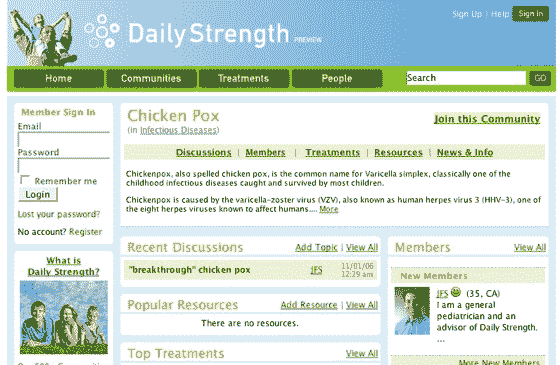

# DailyStrength:在线支持小组和综合治疗信息 TechCrunch

> 原文：<https://web.archive.org/web/http://www.techcrunch.com:80/2006/11/07/daily-strength-online-support-groups-and-aggregate-treatment-info/>

# DailyStrength:在线支持小组和汇总治疗信息

[daily strength](https://web.archive.org/web/20210302041127/http://www.dailystrength.org/)是一个新的社交网络，它为具有各种医疗、心理和生活状况的人提供了一个讨论他们的斗争和正在接受的治疗的空间。虽然未来几年可能会涌现出许多想要成为社交网络的人，试图从在线医疗活动中获利，但这不是其中之一。DailyStrength 的管理团队和功能集是一个真正的玩家。我认为这是一个很好的例子，一个提供话题价值广告的利基社交网络，并且也很好地执行了基本原则。

该网站由 Doug Hirsch 创建，他是雅虎的第一批员工之一。最近在脸书。该网站的外观和感觉与这两家公司的产品有些相似。Hirsch 说，大多数小众社交网络都会选择受众，但网上的人最关心的是性、金钱和健康。他说健康网络是一个服务远远不足的市场。

DailyStrength 使用了“社区”一词，有些人可能会使用“条件”，这可能会被那些不在乎失明或耳聋等被称为疾病的经历的人所理解。也请注意，该网站使用“预览”一词，而不是测试版。我知道有些人会喜欢的。

DailyStrength 的亮点是要求用户描述他们所经历的医疗和心理治疗。他们指出了这些治疗的条件，是否有效，并提供了一个关于经验的叙述。这些信息随后会根据病情和治疗进行汇总，因此很容易看出许多人对某一病情采取了什么措施，或者接受某种治疗到底是什么感觉。到目前为止，一些社区比其他社区人口多，例如勃起功能障碍社区还没有任何人加入(如果你想知道的话)。

有没有想过用 [Lexapro](https://web.archive.org/web/20210302041127/http://www.dailystrength.org/treatments/Lexapro/) ？在每日力量训练中使用过它的 58 人中，只有 45%的人认为它有帮助。这是个有趣的信息，假设投诉者不是竞争对手制药公司或公关公司的员工。

讨论和支持功能对用户来说也很有价值。我和我的朋友南希·怀特(Nancy White)谈论了她帮助建立的名为[分享你的故事](https://web.archive.org/web/20210302041127/http://www.shareyourstory.org/)的“一角硬币的进军”项目，我知道医疗社交网络和博客可以取得巨大的成功。

目前数据库里有 25000 种治疗方法。每种治疗和条件都有一个讨论空间。关于这个主题的新闻和维基百科条目摘录。该公司付钱让四名医生参与网站，DailyStrength 谨慎地反对或删除用户发布的医疗建议。Hirsch 告诉我，他交谈过的许多医生都完全支持该网站，因为这是患者在就诊前后自我教育的一种方式。该网站还有一个资源部分，在那里你可以找到，例如，一长串用户贡献的无麸质食物食谱。

网站上已经有相当多的活动，许多人互相提供支持。该网站主要针对女性，Hirsch 说，看到脸书 75%的流量来自女性，他明白了这是社交网络的主要受众。

在未来几周，该公司将与第三方服务合作，提供聊天、视频和更好的照片共享。广告收入将在 DailyStrength 和由用户投票决定的特定慈善机构之间分配。赫希说，他对大型制药公司持观望态度，可能会专注于从更多“健康”导向的广告商那里寻求广告收入。

每个人都说，女性、健康、社区和信息资源是网络未来的重要因素——当然，女性不仅仅是一个消费市场，希望她们能够平等地参与建设新的网络。我认为 DailyStrength 是一个针对这些细分市场的构建良好且有用的网站。
