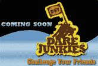

# Darejunkies 是一个为蠢驴们准备的社交网站

> 原文：<https://web.archive.org/web/http://www.techcrunch.com:80/2006/12/12/darejunkies-is-a-social-networking-site-for-jackasses>

# Darejunkies 是一个为蠢驴服务的社交网站

 在每一集之前,《傻瓜秀》都有“不要在家尝试这个”的免责声明，因为太多的白痴实际上会“在家尝试这个”一个名为[夜瘾者](https://web.archive.org/web/20201123193934/http://www.darejunkies.com/)的新网站今天上线，全力支持“在家试试这个”

Darejunkies 是一个社交网站，允许用户在有奖激励的情况下创建和竞争 dares。网站今天上线了，我第一次登录。它太棒了，这意味着它可能会大受欢迎。

去 Darejunkies 网站，你会发现按类别列出的挑战，如约会、尴尬、食物等。有些挑战就像把自己裹在花生酱里去狗公园，或者让你奶奶告诉你一些尴尬的事情。一旦你发现一个你认为你能以最有趣的方式完成的挑战，你就接受它。

一旦你拍摄了你的挑战，你可以把它上传到网站上，并与该挑战的所有其他版本竞争。用户投票选出最佳视频。参赛者每个月都有资格获得奖金。这个月，十名获胜者将分享 5000 美元的奖金。下个月，该公司将赌注提高到 7500 美元，此后每个月将奖励 10000 美元。

“我们的想法是，这些视频是有目的的，”Darejunkies 的首席执行官本·巴卡尔说。“所以人们可以拿起相机，问‘我拍什么？’然后他们去现场，找一些他们认为可以拍的东西，有一些方向。我们都知道，每个优秀的电视飞行员都有一个蓝图。"

瘾君子们很聪明，他们会提前考虑合法掩盖他们的屁股。你不能只是去网站上发布一个挑战，让每个人都在自己身上涂上黄油，然后从屋顶上滑下来。你可以提交一份挑战，由冒险上瘾者法律委员会审查，然后他们将决定哪些人可以进入网站。

Darejunkies 拥有所有的社交网络元素:用户资料、关系等。我不确定让有服用倾向的人敢于社交网络是世界上最聪明的事情。我现在能听到我妈在教训我不良交往。

那么，你如何在白痴小品上赚钱呢？当然是赞助挑战。

Darejunkies 的总裁达龙·尼梅罗(Daron Niemerow)说:“植入式广告挑战是让广告商加入我们的挑战的一种方式。“所以我们可以说，百事可乐的挑战就像喝一罐百事可乐，给我们打个最大的嗝。我们还在考虑最好的 DVD，比如《蠢驴》或《疯狂的女孩》,因为有些东西在网站上找不到。

我害怕。但我会看的。