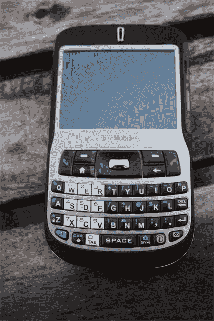

# 短跑比赛最后一搏| TechCrunch

> 原文：<https://web.archive.org/web/http://techcrunch.com/2006/11/16/dash-contest-last-gasp/>

显然，在视频制作方面，我们对亲爱的读者要求太多了。[两个](https://web.archive.org/web/20160322054124/http://crunchgear.com/2006/11/14/dash-detox-contest-update-the-nagging-wife/) [人](https://web.archive.org/web/20160322054124/http://crunchgear.com/2006/11/11/first-dash-contest-entrant/)参加了短跑比赛，看起来有两个人会赢——我这里就有两个人，所以那些男孩加倍幸运。

如果你还想参加，请自便，但我们下周一早上就要结束比赛了。
继续阅读规则…

> 以下是应该做的:拿一个网络摄像头或摄像机。拍摄一个一分钟的视频，你告诉我要保持坚强，你最好的建议是帮助我清除我血液中的疯眼毒素，我们称之为手机。提醒我随身携带四部手机是不自然的，会让我得癌症。告诉我不用手机与朋友、家人和公关保持联系的最佳方式。告诉我我应该忍气吞声，使用付费电话。任何能帮我度过这一天的事情。我需要 30 个，伙计们，开始吧。
> 
> 录制您的视频。用标签“嘎吱嘎吱”把它上传到 YouTube 上，并用电子邮件把视频链接发给 contest@crunchgear.com。我们需要 30 份参赛作品，所以请随时参赛。到 11 月 20 日星期一，浏览次数最多的五个条目将出现在网站上，读者将在 11 月 21 日投票选出获胜者。