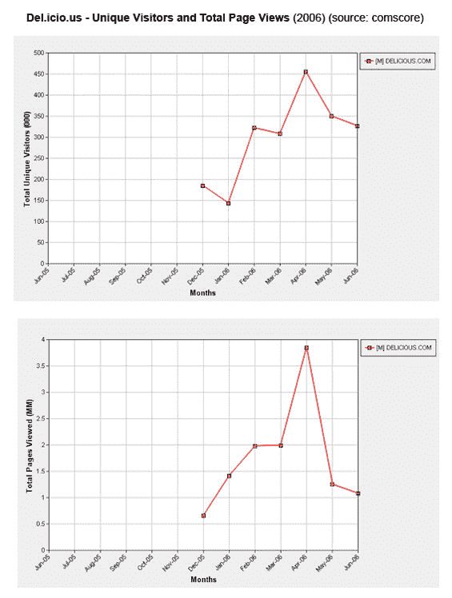

# 再次让我们眼花缭乱，del . icio . Us TechCrunch

> 原文：<https://web.archive.org/web/http://www.techcrunch.com:80/2006/08/04/dazzle-us-again-delicious/>

**更新:**看我在 del.icio.us 上更新的帖子，“[更多关于 Del.icio.us 的统计，这次是正面的](https://web.archive.org/web/20230213025703/https://techcrunch.com/2006/08/04/more-stats-on-delicious-this-time-positive/)”

  自从 [Del.icio.us](https://web.archive.org/web/20230213025703/http://del.icio.us/) 被雅虎收购以来[已经过去了将近八个月](https://web.archive.org/web/20230213025703/https://techcrunch.com/2005/12/09/yahoo-acquires-delicious/)，它仍然是社交书签的卫冕冠军。

但是最近的数据看起来不太好。事实上，从某些方面来看，他们已经彻底失败了。康姆斯克显示美国的独立访问者和页面浏览量在 2006 年 4 月达到峰值(455，000 独立访问者和 400 万页面浏览量)。到 6 月份，这些数字已经下降到 350，000 unique 和大约 100 万页面浏览量。

下降是显著的。Uniques 下降了 22%,**页面浏览量下降了 75%** ,抹去了今年所有的流量收益。Del.icio.us 的流量水平实际上与 2005 年 12 月被收购时一样。虽然这些数字可能是错误的，但显示的趋势可能更可靠。

有一点需要注意:这些数字是 delicious.com 的，而不是 del.icio.us 的(尽管 del.icio.us 拥有。com 域名)。我搜索了 del.icio.us 的创始人乔舒亚·夏科特(Joshua Schacter)进行澄清并获得了评论。他的回答是*“唉，得通过公关了】*。哦，时代变了——去年 12 月，我通过与 Joshua 的一次公开的、没有公关成分的即时聊天，发现了雅虎收购 del.icio.us 的消息。无论如何，我希望明天能得到雅虎的公关评论，并找到合适的人选。

Alexa 讲述了一个[不同的故事](https://web.archive.org/web/20230213025703/http://www.alexaholic.com/del.icio.us+digg.com?y=p&r=6m&z=6)，页面浏览量增长在 4 月份达到顶峰，然后从那以后就持平了(为了比较，我把 Digg 加到了链接图表中)。

不管这两种说法中哪一种是正确的，或者真相介于两者之间，del.icio.us 都陷入了困境，需要走出来。

今年有一些显著的功能改进。在 4 月份，他们增加了一个“网络”功能，通过使添加和监控朋友的书签变得更加容易，从本质上改善了网站的社交网络方面。

今天，他们[在该功能上增加了](https://web.archive.org/web/20230213025703/http://www.ysearchblog.com/archives/000337.html)，为网站发布了一个“网络徽章”小工具，并提供了一种查看特定标签周围活跃用户的新方法。

> 在这两个特征之间，我们继续努力使人和联系成为 del.icio.us 体验的核心。我们在这方面有更多的计划，所以请继续关注，让我们知道你的想法。

哈欠…到目前为止，甚至没有人费心去评论雅虎搜索博客上的[帖子](https://web.archive.org/web/20230213025703/http://www.ysearchblog.com/archives/000337.html)，它往往会引发很多讨论。

del.icio.us 是否挖掘出了早期用户群？社会化书签会不会无法成为主流？

我认为主流用户会希望使用 del.icio.us，就像他们开始接受 flickr 的照片功能一样(这些功能已经在雅虎照片中[推出)。一些用户呼吁重新设计……更华丽、更大胆的设计。我觉得这不是答案。对我来说，更简单的书签和更好的分享工具似乎是正确的方向。](https://web.archive.org/web/20230213025703/https://techcrunch.com/2006/06/07/yahoo-photos-beta-launches-today/)[蓝点](https://web.archive.org/web/20230213025703/http://www.bluedot.us/)，一家我们[最近对](https://web.archive.org/web/20230213025703/https://techcrunch.com/2006/07/06/blue-dot-is-not-just-another-social-bookmarking-system/)做了简介的公司，从那以后吸引了我的注意，它可能有正确的组合来获得主流的注意(我真的很喜欢只和我的朋友分享书签的能力)。

加油 Del.icio.us..再次让我们眼花缭乱。