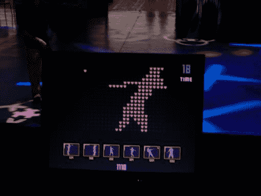

# DDR 针对您身体的其他部分

> 原文：<https://web.archive.org/web/http://techcrunch.com/2006/09/01/ddr-for-the-rest-of-your-body/>

# DDR 为你身体的其余部分

Mossalibra 是一款针对舞蹈俱乐部和派对的新游戏。使用[动作捕捉技术](https://web.archive.org/web/20210225223614/http://www.nastypixel.com/prototype/?page_id=86)来绘制玩家的动作，游戏将玩家转化为像素化的图像。然后图像被投射到墙上，让每个人都能看到你是一个多么糟糕的舞者。当你模仿其他角色的动作或者你创造了一些新的和令人兴奋的东西时，你就得分了。这样，游戏总是新的和有机的。场地也应该能够通过查看当前的舞蹈动作来跟上“俱乐部中不断变化的情绪”。

 [https://web.archive.org/web/20210225223614if_/https://www.youtube.com/embed/7BSYo0mcFWQ?version=3&rel=1&showsearch=0&showinfo=1&iv_load_policy=1&fs=1&hl=en-US&autohide=2&wmode=transparent](https://web.archive.org/web/20210225223614if_/https://www.youtube.com/embed/7BSYo0mcFWQ?version=3&rel=1&showsearch=0&showinfo=1&iv_load_policy=1&fs=1&hl=en-US&autohide=2&wmode=transparent)

视频

这可能是个不错的主意。Mossalibra 可以使用周围正在播放的任何音乐，因此它可以在 jam 乐队节日、狂欢或死亡金属音乐会上发挥作用。

[Mossalibra](https://web.archive.org/web/20210225223614/http://www.nastypixel.com/prototype/?page_id=85) 【通过 NastyPixel】