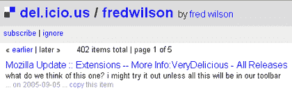

# Del.icio.us 工具栏即将推出 

> 原文：<https://web.archive.org/web/http://www.techcrunch.com:80/2005/09/05/delicious-toolbar-coming/>

# Del.icio.us 工具栏即将推出

这肯定是在谣言类别下提交的，但有两个人分别向我指出了弗雷德·威尔逊的一个[公共 del.icio.us 链接(用户的链接发布在 URL del.icio.us/【用户名】)。](https://web.archive.org/web/20230214030322/http://del.icio.us/fredwilson)

Fred 链接到一个名为[非常美味](https://web.archive.org/web/20230214030322/https://addons.mozilla.org/extensions/moreinfo.php?application=firefox&category=Newest&numpg=10&id=1153%5C)的 del.icio.us 工具栏 Firefox 扩展(见下文)。

在注释部分，他写道“我们认为这个怎么样？我可能会尝试一下，除非这一切都将在我们的工具栏(强调)。弗雷德的基金 [Union Square Ventures](https://web.archive.org/web/20230214030322/http://www.unionsquareventures.com/) ，是 Del.icio.us 的[投资者。因此，这个链接表明 del.icio.us 将会推出自己的工具栏。](https://web.archive.org/web/20230214030322/http://avc.blogs.com/a_vc/2005/04/delicious.html)

现在，既然 Fred 知道许多人都在监控他的美味链接，这让你怀疑他是否只是在瞎搞，和/或利用这一点让市场知道产品即将推出。不管怎样，这将是一个值得拥有的工具栏，我已经等不及约书亚发布它了。

许多其他关于新的美味功能即将推出的传言。我在超级双重秘密 NDA 的保护下。

***更新:**通过[解表](https://web.archive.org/web/20230214030322/http://www.solutionwatch.com/215/toolbar-for-delicious/)，我现在知道 del.icio.us 已经有了[初步的、基本的工具栏出来](https://web.archive.org/web/20230214030322/http://loosewire.typepad.com/blog/2005/07/the_firefox_del.html)。新版本可能很快就要出来了？*