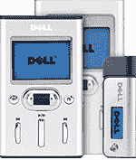

# 戴尔退出 DAP 阶段

> 原文：<https://web.archive.org/web/http://techcrunch.com:80/2006/08/22/dell-exits-dap-stage/>

在 [iLounge](https://web.archive.org/web/20201129132834/http://www.ilounge.com/) 的男孩们今天注意到，戴尔的 DJ Ditty 基于 flash 的数字音频播放器最近从其在线商店消失了。戴尔曾在 2 月份宣布将停止其基于硬盘的 DJ 播放器，Ditty 是其最后一款播放器。现在随着它的消失，戴尔实际上已经走到了 DAP 市场的尽头。戴尔商店目前出售 Sandisk、Samsung、Creative、Archos 和 iRiver 的播放器，苹果公司明显缺乏。我猜他们在小心翼翼地不给敌人提供食物。

[戴尔悄然存在数字音乐播放器市场](https://web.archive.org/web/20201129132834/http://www.ilounge.com/index.php/news/comments/dell-quietly-exits-digital-music-player-market/)