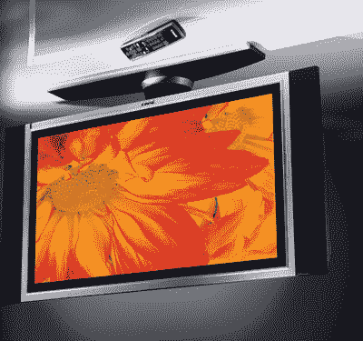

# 戴尔离开液晶电视业务，世界大哭了一场

> 原文：<https://web.archive.org/web/http://techcrunch.com/2007/06/07/dell-leaves-lcd-tv-business-world-weeps-a-great-weep/>

# 戴尔离开液晶电视业务，世界痛哭一场

如果你有戴尔液晶电视，请举手。现在，有多少只手举在空中？一个？两个？十个？诚然，这有些夸张，但这也是戴尔退出液晶电视业务，专注于让它跳舞的东西的原因之一:以沃尔玛般的低价出售的还算不错的电脑。虽然戴尔自己从未生产过任何一款有问题的液晶电视(它只是在第三方电视上贴上自己的商标，然后转售)，但据报道，迈克尔·戴尔认为该公司需要回归根本，重振其不太热门的品牌。换句话说，事实证明液晶电视太浪费资源了。所以他们走了，*菲尼托*，风中的灰尘。

更有趣的是，看看戴尔现在如何为其个人电脑注入活力。前几天有 LED 背光笔记本电脑泄露，这是朝着正确方向迈出的一步。戴尔先生还有什么锦囊妙计来纠正他的错误呢？

[戴尔将退出液晶电视业务:媒体](https://web.archive.org/web/20220628194346/http://today.reuters.com/news/articlenews.aspx?type=technologyNews&storyid=2007-06-07T064116Z_01_TP174354_RTRUKOC_0_US-DELL-TVS.xml)[路透社]