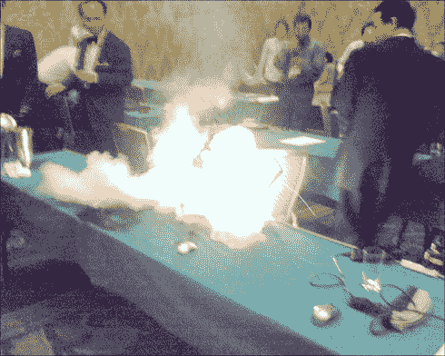

# 戴尔召回 410 万块易着火笔记本电池

> 原文：<https://web.archive.org/web/http://techcrunch.com/2006/08/14/dell-recalls-41-million-fire-prone-notebook-batteries/>

# 戴尔召回 410 万块易着火笔记本电池

戴尔宣布召回 410 万块笔记本电脑电池，警告用户电池可能会着火。虽然该公司没有说电池会爆炸，但它承认它们可能会“爆炸起火”这种由索尼为戴尔制造的电池在 2004 年 4 月至今年 7 月 18 日期间在笔记本电脑上销售。戴尔表示，在美国销售的 240 万台笔记本电脑和其他地方销售的 140 万台笔记本电脑安装了有问题的电池，总计约占戴尔同期销售的所有笔记本电脑的 18%。

戴尔最近收到了关于笔记本电脑电池起火的负面宣传，其中一个特别引人注目的事件发生在日本，并有照片记录(见上图)。更糟糕的是，美国消费者产品安全委员会最近的一项调查发现，自 2003 年以来，锂和锂离子电池过热、冒烟或爆炸的次数为 339 次。

虽然戴尔没有估计这次召回的成本，但它可能会给公司带来高达 3 亿美元或更多的损失。索尼证实其电池是罪魁祸首，并表示在召回事件中“财政上支持”戴尔。

[戴尔因火灾威胁召回电池](https://web.archive.org/web/20210416204325/http://www.nytimes.com/2006/08/14/technology/14cnd-battery.html?_r=2&oref=slogin&oref=slogin)【纽约时报】