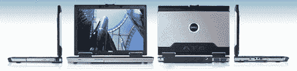

# 戴尔 Latitude D620 ATG 加固型笔记本电脑| TechCrunch

> 原文：<https://web.archive.org/web/http://techcrunch.com/2007/01/16/dells-latitude-d620-atg-rugged-laptop/>

似乎戴尔是最新一家加入加固型笔记本潮流的公司。戴尔的 D620 ATG(全地形等级)笔记本电脑是对松下臭名昭著的 ToughBook 电脑系列的回应，它几乎可以接受任何扔向它们的东西(真的)。基本款起价 2500 美元，配有 14 英寸宽屏显示器、高达 4GB 的 RAM、Core 2 Duo CPUs、端口盖、防震硬盘和防泼溅键盘。那些户外运动爱好者/笨手笨脚的人应该马上去 Dell.com 订购一台。

[戴尔推出加固型 Latitude 笔记本电脑](https://web.archive.org/web/20151007102303/http://www.electronista.com/articles/07/01/16/dell.latitude.atg/)