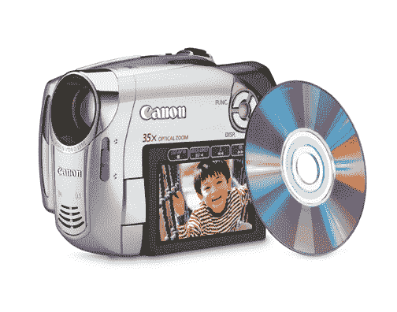
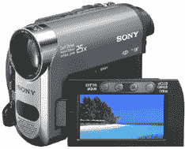

# 揭秘数码:新的简易摄像机

> 原文：<https://web.archive.org/web/http://techcrunch.com:80/2007/07/11/demystifyingdigital-new-easy-camcorders/>

*DemystifyingDigital 是由【DemystifyingDigital.com*的编辑丹·哈夫里克撰写的一个新专题

如果你曾经在百思买看过数码摄像机的退货率，你就会知道它们是一些最令人沮丧的难以使用的小玩意。这一切都开始改变，尽管新的录制格式越来越受欢迎，包括基于 DVD 的摄像机和录制到硬盘驱动器和存储卡的摄像机。下面是一些我们最喜欢的新的简单的数码摄像机，有足够的火力把你变成小史蒂文·斯皮尔伯格

**三洋 Xacti E1**
有了新款防水三洋 Xacti E1，今年夏天在海滩或泳池拍摄视频将变得轻而易举。除了捕捉视频，exact E1 还可以拍摄 600 万像素的照片，这使得这款防溅奇迹成为一款出色的二合一设备。或许 Xacti E1 最酷的一点是，它可以在水下 5 英尺深的地方录制长达 30 分钟的视频剪辑。499 美元

**佳能 DC230**
配有 35 倍光学镜头的长变焦佳能 DC230 拥有让你近距离感受动作的一切。具有三种预设缩放速度的平滑缩放功能特别有助于消除长时间缩放时会降低质量的不稳定外观。DC230 可录制成 DVD，这是最容易使用的摄像机格式之一。450 美元

**索尼 DCR-HC48**
还记得那种录制到 miniDV 磁带的摄录机吗？是的，它们仍然在生产，许多用户喜欢这些型号提供的简单性和可负担性。索尼 DCR-HC48 的最大特点之一是它的 25 倍光学变焦，可以轻松拍摄整个足球场。它还有一个出色的图像传感器，一个简单易用的 2.7 英寸宽触摸屏液晶显示器，并包括一个 Handycam 坞站，可以轻松连接到您的计算机或电视。
380 美元