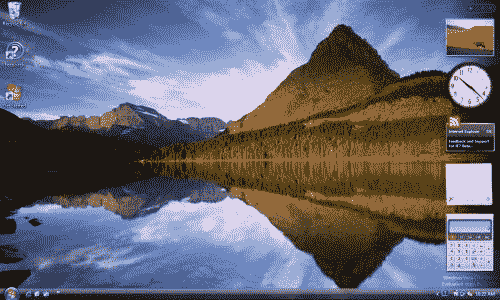

# 桌面小工具 101 

> 原文：<https://web.archive.org/web/http://www.techcrunch.com:80/2007/01/29/desktop-widgets-101/>

对于那些不知道 widgets 基础知识，或者不知道桌面和网络 widgets 之间区别的人来说，看看雅虎 Widgets 博客上的[这篇令人惊讶的公正的综述文章](https://web.archive.org/web/20220927015821/http://widgets.yahoo.net/blog/?p=16#more-16)，他们谈论了雅虎、微软、谷歌和苹果提供的四个主要桌面 Widgets 平台的优缺点。

在决定构建小部件时要考虑哪些平台时，一个关键因素是整体发行版和构建供桌面和 web 使用的单个小部件的能力。从这些方面来考虑，很难反驳 Vista，它将很快比桌面上所有其他产品的分布都要广。Vista 小工具也适用于 Live.com 页面。然而，对于拥有足够资源的公司来说，在所有四个平台上进行构建相对简单。

这篇文章遗漏了所有的 widget 初创公司，比如福克斯支持的 [SpringWidgets](https://web.archive.org/web/20220927015821/http://www.beta.techcrunch.com/2006/11/06/fox-interactive-launches-desktopwebsite-widget-platform/) 。更多的即将到来。开发人员也应该密切关注这些平台，如果它们有吸引力的话，就开发这些平台。