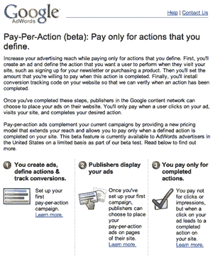

# 消化谷歌新的 PPA 广告产品

> 原文：<https://web.archive.org/web/http://www.techcrunch.com/2007/03/21/digesting-googles-new-ppa-%20advertising-product/>

今天，谷歌[宣布](https://web.archive.org/web/20081204195451/http://adwords.blogspot.com/2007/03/pay-per-action-beta-test.html)测试一种新的按行为付费(PPA)广告产品。这一点很重要，原因有很多，其中一个重要的事实是，谷歌控制了如此多的在线广告市场，以至于他们在广告方面做的任何事情都会对互联网产生真正的影响。

**背景**

到目前为止，谷歌主要销售点击费广告。当谷歌或谷歌合作伙伴网站上的某个人点击广告，广告就会被发送到广告商指定的网页，广告商就要为此付费。广告商喜欢这一点，因为他们只有在潜在客户在他们手中时才会付费。他们不喜欢它，因为点击欺诈——出版商和广告商的竞争对手有动机点击这些广告并产生收入(或只是广告商的成本)。由于谷歌有一个短期的财政激励来促进点击欺诈，多年来围绕这个话题有很多争论。

PPA 广告旨在降低点击欺诈的风险。现在，只有当客户被送到网站并采取进一步行动，如购买产品或填写网络表格时，广告商才支付费用。

像 CPC 广告一样，PPA 广告也不是谷歌发明的。例如，搜索引擎 Snap 以这种方式销售广告已经有一段时间了。另一家创业公司 [Turn](https://web.archive.org/web/20081204195451/http://www.techcrunch.com/2006/11/06/turn-to-launch-hybrid-cpa-ad-network/) ，也在做这个业务。其他人也是。

PPA 还要求广告网络具有额外的复杂性。此前，谷歌向一个网站提供用户，并为点击发送账单。现在，Google 需要通过接收来自广告商的确认来验证“行为”已经发生。

广告客户当然会有不确认该行为的动机，但谷歌将能够很容易地对此进行调整。像 CPC 广告一样，PPA 广告将根据谷歌的盈利能力进行排名。谷歌只需要计算 PPA 广告客户点击的平均价值，然后这些广告就可以按盈利能力排名。CPC 和 PPA 的广告甚至可以混合，尽管谷歌还没有这样做。

**后果**

 这不会对大广告商产生太大影响，因为他们已经非常密切地跟踪 CPC 广告的投资回报率。不过，对于较小的广告商来说，点击欺诈可能会造成严重破坏。大量过滤点击欺诈的能力将帮助他们比以前更密切地跟踪投资回报率。这对他们会是一个很大的帮助。

像 Commission Junction 和 LinkShare 这样的联盟营销网络已经完蛋了。这些网络也是基于每次行动的成本运作的，主要是与在线零售商合作。即使他们中的一些有规模，他们也没有能力在纯粹的网络规模上与谷歌竞争。广告商趋之若鹜，这推动了平均价格的上涨。当价格上涨时，出版商蜂拥至新平台，因为他们会赚得更多。随着新产品规模的扩大，随着时间的推移，寻找来自大联盟网络的严重出版商泄漏。如果你想争论这一点，请注意 Commission Junction 的母公司 ValueClick 今天的[股价](https://web.archive.org/web/20081204195451/http://finance.google.com/finance?q=VCLK)发生了什么。尽管市场已经在很大程度上对这一消息进行了调整，但增加 PPA 广告的举措已经传言了一段时间。

这应该有利于谷歌的整体市场份额和长期收入增长。随着投资回报率的增加，任何将欺诈赶出网络的行为都会让广告商实际上花更多的钱，而不是更少。

雅虎现在处于一个不值得羡慕的位置，再次扮演跟随领导者的角色，即使他们从今年早些时候的大规模[巴拿马发布](https://web.archive.org/web/20081204195451/http://www.techcrunch.com/2006/12/13/yahoo-begins-panama-roll-out-in-the-us/)中喘口气。

**哦耶，谷歌也发布了…**

谷歌今天还宣布了一个新的“文本链接格式”广告单元。这一点在[博客文章](https://web.archive.org/web/20081204195451/http://adwords.blogspot.com/2007/03/pay-per-action-beta-test.html)的第四段中提到过(没有特别强调)，在 PPA 产品[常见问题](https://web.archive.org/web/20081204195451/http://services.google.com/payperaction/faq.html)中也有讨论:

> 按行为付费广告的文字链接格式是什么？
> 文本链接是具有出版商页面特征的超链接简短文本描述。出版商可以将它们与其他文本放在一起，以更好地融合广告并推广您的产品。
> 
> 例如，您可能会在出版商的推荐文本中看到以下文本链接:“小工具很有趣！我鼓励我所有的朋友今天就买一个高质量的小工具。”(将鼠标放在链接上，会显示“谷歌广告”,将这些广告识别为按行为付费的广告)。
> 
> 虽然文本链接的最大长度是 90 个字符，但我们发现较短的链接效果更好，因为它们允许发布者在他/她的网站上的更多地方和不同的上下文中使用该链接。最大长度为 90 个字符，但最好少于 5 个单词。更好的是，只使用你的品牌名称来为出版商提供最大的灵活性。

谷歌广告将不再需要被限制在网站上自己的空间——出版商可以巧妙地将广告嵌入到网站本身主要内容的超链接中(见上面引用的第二段)。其他公司已经这样做了，但谷歌以前从未涉足“广告”领域。

他们在这里越过了模糊的道德界限。如果这个产品被单独公布，它将会被博客和媒体激烈地争论。但是通过隐藏在其他更大的新闻中，他们基本上避免了这件事实际上应该得到的批判性分析。