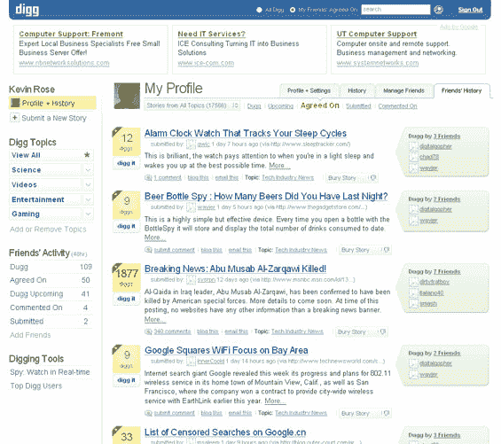
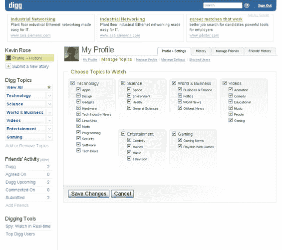
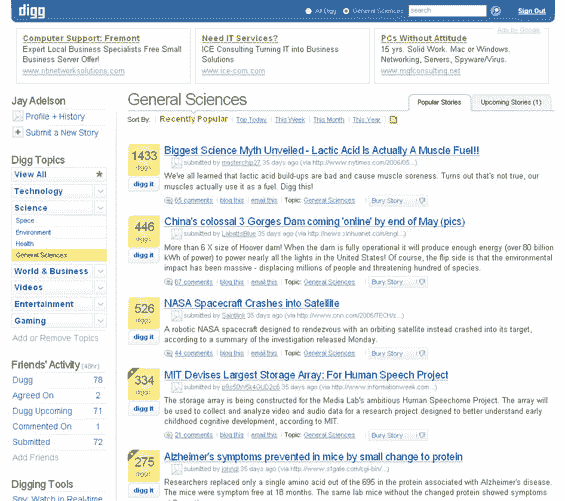
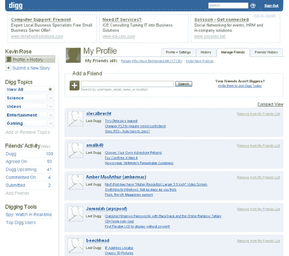

# Digg 3.0 将于周一发布:独家截图和统计数据 TechCrunch

> 原文：<https://web.archive.org/web/http://www.techcrunch.com:80/2006/06/22/digg-30-to-launch-monday-exclusive-screenshots-and-stats/>

  [Digg 3.0](https://web.archive.org/web/20220923160809/http://www.digg.com/) 将于太平洋标准时间 6 月 26 日星期一上午发布。发布会在今天晚上宣布，Digg 给我提供了一些截图，包括在这篇文章中。

理查德·麦克马努斯和我就新的发布采访了 Digg 创始人杰伊·阿德尔森和凯文·罗斯，我们还花了一些时间谈论 Digg 的新竞争对手网景以及其他与 Digg 相关的问题。在 TalkCrunch 上听播客。

除了重新设计(保留了 Digg 的基本“体验”)，Digg 还在技术之外增加了许多新闻类别。主题分为六个“容器”，包括技术、娱乐、游戏、科学、世界和商业以及在线视频。Digg 上的默认视图仍然是技术容器，尽管用户可以改变这个视图，也可以取消选择容器中的单个主题，以进一步细化他们在主页上看到的内容。

还有其他重要的新增功能(我们将在[播客](https://web.archive.org/web/20220923160809/http://www.talkcrunch.com/2006/06/22/episode-10-digg-30-launches-interview-with-founders-kevin-rose-jay-adelson/)中一一介绍)。除了查看你的朋友有什么 dugg，用户还可以看到不止一个朋友有 dugg 的故事，进一步过滤新的故事到他们真正想看的。此外，在头条新闻和新新闻之间切换视图不需要刷新页面——Digg 已经添加了 Ajax 特性(他们强调这是保守的),可以在标题和新新闻之间以及主题/容器之间快速切换。

Digg 看起来越来越像网络报纸，甚至在页面浏览量上挑战《纽约时报》( Digg 早就超过了竞争对手 Slashdot)。

每天大约有 80 万独立访问者访问 Digg，产生 900 多万页面浏览量。该网站的流量每两个月翻一番。令人惊奇的是，Digg 只用 15 名员工就做到了这一切。

Digg 已经从 Greylock 和 Omidyar 以及天使投资者马克·安德森、雷德·霍夫曼和罗恩·康韦那里筹集了 280 万美元的风险投资。鉴于巨大的增长和热情的用户，我觉得他们将会有一个相当大的流动性事件。

屏幕截图:

 **更新:** [今晚 Digg 派对的照片在这里](https://web.archive.org/web/20220923160809/http://laughingsquid.com/2006/06/22/digg-v3-party-photos/)