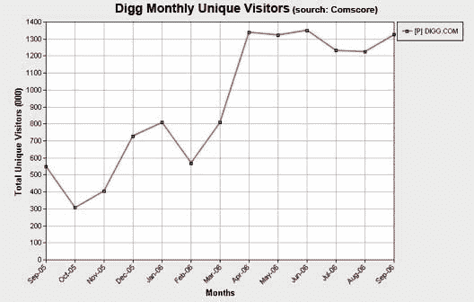

# Digg 与新闻集团共舞收购

> 原文：<https://web.archive.org/web/http://www.techcrunch.com:80/2006/10/24/digg-does-the-acquisition-dance-with-news-corp>

# Digg 与新闻集团共舞收购。

据接近谈判的多个消息来源称，总部位于旧金山的初创公司 [Digg](https://web.archive.org/web/20230226101552/http://www.digg.com/) 最近一直在与包括新闻集团在内的多家公司进行收购谈判。然而，该公司无法在他们寻求的价格范围内获得报价——至少 1.5 亿美元——并且可能会完成 B 轮融资。

似乎是即将到来的融资的传言导致新闻集团和其他公司开始与 Digg 进行收购讨论，随后讨论也向其他感兴趣的各方开放。有消息称，由于 Digg 的最低售价至少为 1.5 亿美元，因此没有正式的书面报价。

一个争议点是围绕 Digg 声称的 2000 万每月独立访客和急剧的每月增长，而康姆斯克最近 9 月的报告显示只有 130 万每月独立访客和自 4 月以来的持平增长(见下图)。康姆斯克是出了名的古怪，这些数字只是美国家庭的。几乎可以肯定，康姆斯克明显低估了 Digg 的流量。

如果在接下来的一周左右没有超过 1.5 亿美元的确定报价，那么 Digg 可能会在今年晚些时候完成 500 多万美元的第二轮融资，可能会与 Greylock Partners 合作。Greylock 已经是 Digg 的投资者，在 2005 年 10 月领投了他们 280 万美元的 A 轮融资(Omidyar Network 和几个天使投资人也参与了该轮)。