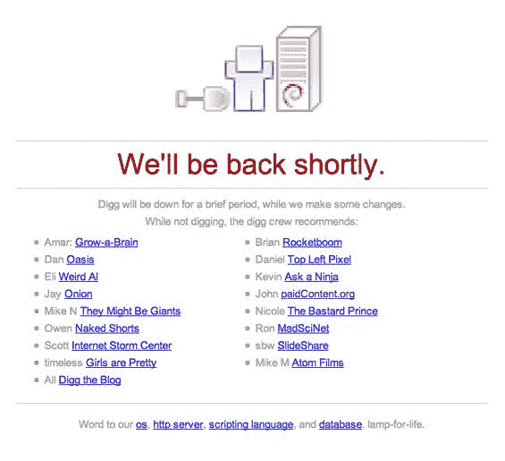

# Digg 打嗝了——网站瘫痪近两个小时——tech crunch

> 原文：<https://web.archive.org/web/http://www.techcrunch.com:80/2006/12/19/digg-has-hiccups-site-down-for-nearly-two-hours/>

# Digg 打嗝了——网站瘫痪了将近两个小时

今天 Digg 的[变化](https://web.archive.org/web/20210127045631/http://www.beta.techcrunch.com/2006/12/18/digg-breaks-away-from-all-news-focus/)一定给 ol 的服务器带来了压力。截至太平洋标准时间凌晨 2 点，该网站已经关闭近[两个小时](https://web.archive.org/web/20210127045631/http://uptime.pingdom.com/site/month_summary/site_name/www.digg.com)。与此同时，Digg 的工作人员推荐了一些链接来让读者保持忙碌。我们将继续报告这些中断，直到他们将 TechCrunch 添加到列表中。

[挖掘这个故事](https://web.archive.org/web/20210127045631/http://www.digg.com/)。(哦，等等，你不能)

