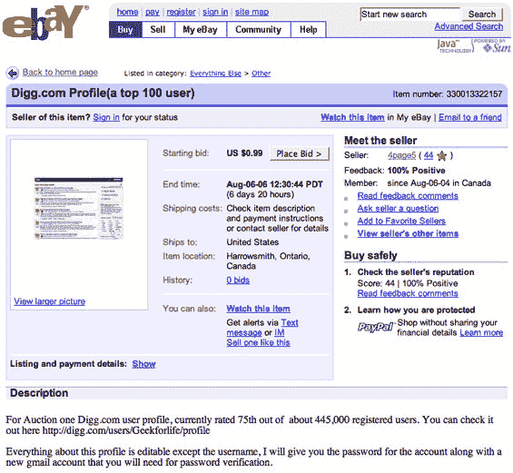

# Digg 简介在易贝 TechCrunch 上出售

> 原文：<https://web.archive.org/web/http://www.techcrunch.com:80/2006/07/30/digg-profile-for-sale-on-ebay/>

# 易贝上出售的 Digg 简介

 最近所有关于 Digg 顶级用户被网景提供现金[转移到他们的竞争平台的新闻，我毫不惊讶地看到有人显然把他们的前 100 名 Digg 简介](https://web.archive.org/web/20230101180832/http://techcrunch.com/2006/07/19/huge-red-flag-at-netscape/)[放在易贝](https://web.archive.org/web/20230101180832/http://cgi.ebay.com/ws/eBayISAPI.dll?ViewItem&ih=014&item=330013322157&rd=1&sspagename=STRK%3AMESE%3AIT&rd=1)上出售。

几个小时前开始的拍卖是为了 Digg 用户名 [GeekForLife](https://web.archive.org/web/20230101180832/http://digg.com/users/Geekforlife/profile) 。用户已经提交了 748 个 Digg 故事，其中 39 个出现在了 Digg 主页上。截至太平洋时间周日下午 4 点，没有竞标者。

账户有价值有两个理由。首先，当然是 Netscape 现在向顶级 Digg 用户付费来转换。网景寻找的是真正的用户，而不是账户，所以这个账户在网景变成有价值的收入流的可能性很小。第二，当他们挖掘一个故事时，排名高的 Digg 帐户比其他帐户更重要，这使得该故事更有可能出现在主页上。因此，如果 Digg 不简单地关闭这个账户，它还是有价值的。

当然，这个故事已经被放到了 Digg 上。

