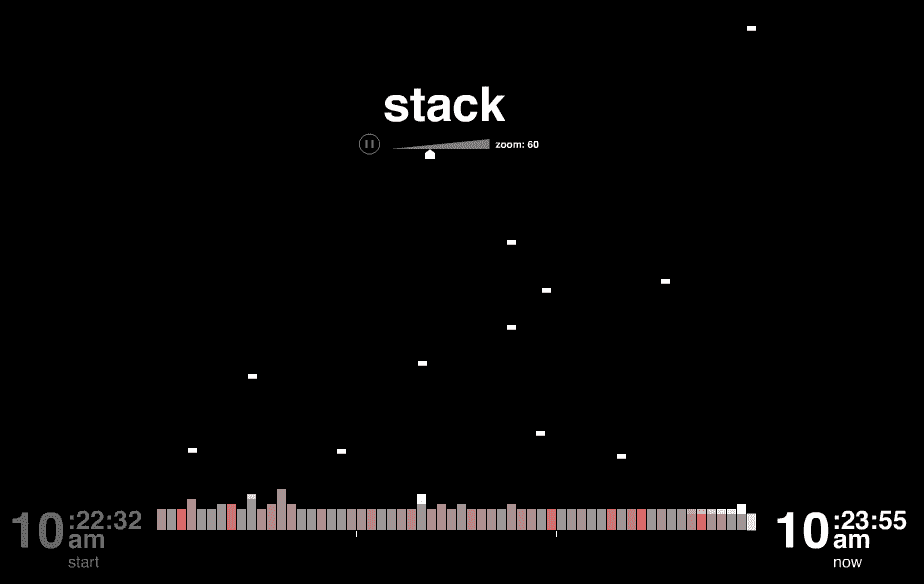
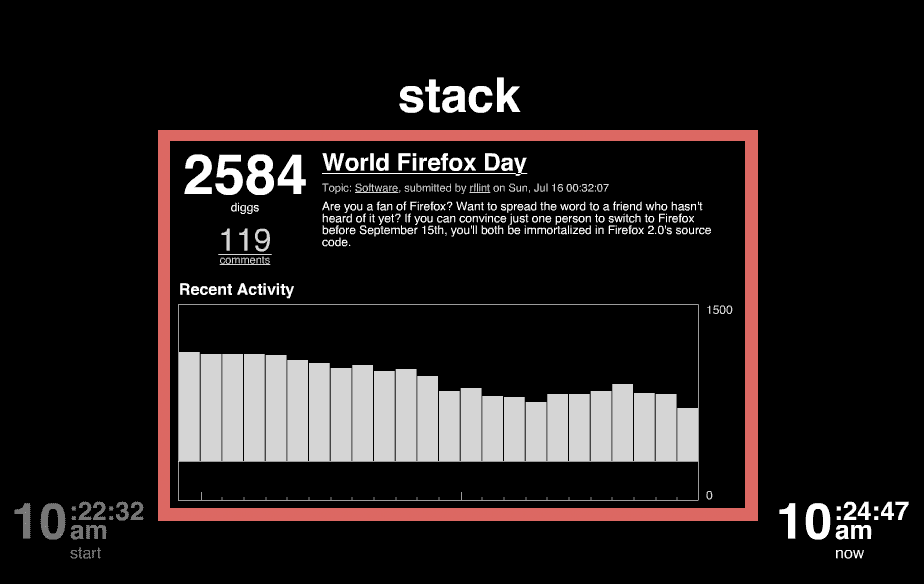
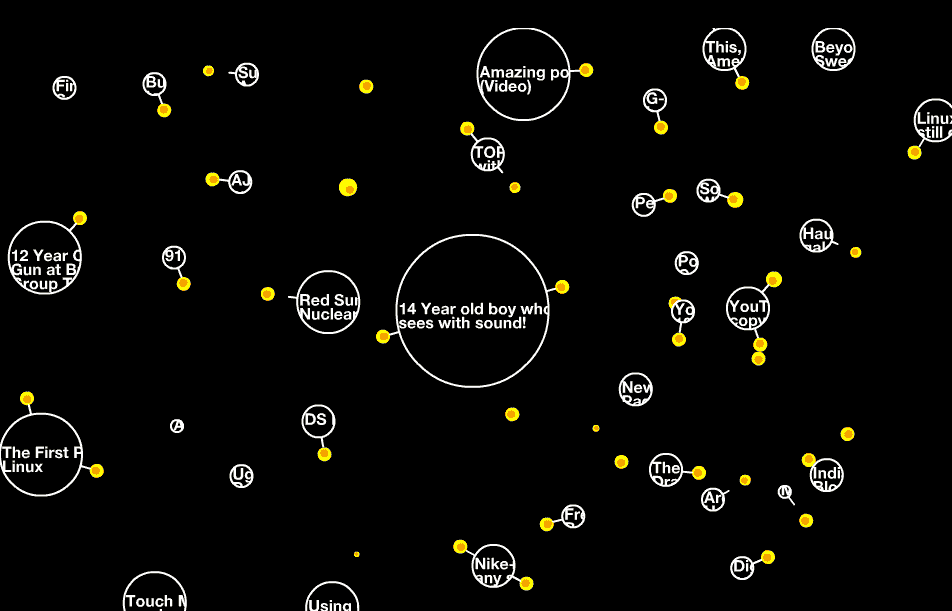

# Digg 将加入体育、Swarm & Stack 

> 原文：<https://web.archive.org/web/http://www.techcrunch.com:80/2006/07/17/digg-to-add-sports-swarm-stack/>

[Digg](https://web.archive.org/web/20220928200349/http://www.digg.com/)上个月晚些时候推出了，对用户界面进行了调整，并增加了新的类别，将 Digg 扩展到科技新闻之外。这一发布，以及用户统计数据显示的巨大增长，第一次将 Digg 推向了主流互联网用户的意识。想了解更多关于 Digg 第三版的信息，请听我们的播客，Digg 创始人凯文·罗斯和杰伊·阿德尔森在 TalkCrunch 上的发言。

更多的功能将会出现在 Digg 上，我们有来自 Digg 测试者的截图——Digg Stack 和 Digg Swarm。Swarm 和 Stack 将于 2006 年 7 月 24 日星期一发布。上个月，Scott Beale 在 Digg 发布会上拍摄了这些产品的早期版本( [swarm](https://web.archive.org/web/20220928200349/http://www.flickr.com/photos/laughingsquid/173085725/) ， [stack](https://web.archive.org/web/20220928200349/http://www.flickr.com/photos/laughingsquid/173085694/in/photostream/) )。据我所知，下面的照片是网络上第一批干净的图片。也有关于体育作为一个新的 Digg 类别的消息。

**Digg 体育**

**体育将在八月初作为一个主题类别被添加进来。当前类别包括技术、科学、世界商业、视频、娱乐和游戏。随着体育的加入，新的主流互联网受众将有更多的理由访问 Digg 获取新闻。**

**Digg 栈**

Digg Stack 是一个基于 Flash 的可视化应用程序，可以实时显示发生在故事上的 Digg。下面有两张截图。第一个显示多个故事(每个故事底部有一个竖条)。当 Diggs 被添加到一个故事中时，块向下落到垂直条上，使其相对于其他故事更高。第二个镜头显示了一个单独的故事(通过单击第一个镜头中的一个栏来查看)。一段时间内的 Digg 活动显示在故事窗口中。

**Digg 虫群**

Digg Swarm 也是一个基于 Flash 的可视化应用程序。它显示的故事(透明的圆圈)基于 Diggs 的数量更大。黄色的点是用户，当他们挖掘故事时会在屏幕上闪烁。一些故事显示了多个链接用户，这表明该故事的势头更强。

Swarm 和 Stack 的结合，以及现有的 [Digg Spy](https://web.archive.org/web/20220928200349/http://www.digg.com/spy) ，将为用户提供更多关于实时新闻的信息，而不仅仅是在 Digg 主页或个人主题页面上可以看到的信息。对于那些对真正的突发新闻感兴趣的用户来说，这些工具会很有用。