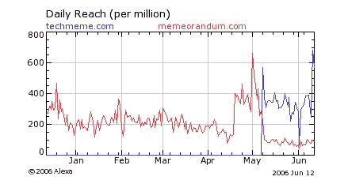
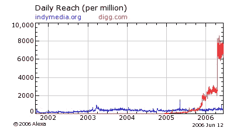

# Digg v3 截图展示了超越技术的目标:它会起作用吗？TechCrunch

> 原文：<https://web.archive.org/web/http://www.techcrunch.com:80/2006/06/14/digg-v3-screenshots-show-aims-beyond-tech-will-it-work/>

# Digg v3 截图展示了超越技术的目标:它会起作用吗？

 [Valleywag](https://web.archive.org/web/20221209001345/http://www.valleywag.com/tech/digg/scoop-exclusive-screenshots-reveal-digg-v3-will-cover-all-news-180760.php) 今天得到独家消息，广受欢迎的新闻网站 [Digg](https://web.archive.org/web/20221209001345/http://digg.com/) 的下一个版本将包括科技之外的许多新类别。其他有兴趣和专业知识的社区是否会跟随并填充一个扩大的 digg 空间似乎是个问题。

以下是 Valleywag 发现的与当前设计相应部分的截屏并排的截屏。

上面，两个类别列表，新的在右边。类别和登录被一起移动到屏幕的左边。突出显示非技术类别。

更多的图片和一些图表后，跳转。
 

上图，新的设计允许故事被流行的日报、周报、月报或最近的报纸浏览。

许多人担心，科技话题中的小玩笑只会在政治新闻中变得更糟。许多人试图在非技术主题上创建 digg 克隆，但大多收效甚微。

下面是两个可能相关的比较，尽管并不完美:

在 [Memeorandum](https://web.archive.org/web/20221209001345/http://memeorandum.com/) 的流量，在[techmeme.com](https://web.archive.org/web/20221209001345/http://techmeme.com/)的技术部分被赋予自己的域名之前和之后，政治被分别统计。

比较一下全球用户生成内容超级网络的流量，[Indymedia.org](https://web.archive.org/web/20221209001345/http://indymedia.org/)和 [Digg](https://web.archive.org/web/20221209001345/http://digg.com/) 的极客。以下是迄今为止政治和科技之间的一场较量。

换句话说，我质疑 digg 的技术是否会被有其他兴趣的人占用，或者 Digg 风格的新闻技术是否只对那些对技术感兴趣的人感兴趣。

只是为了好玩，这里有一张 Digg 第一次迭代时的照片——回到 2005 年 1 月的黑暗时代。

感谢[Archive.org](https://web.archive.org/web/20221209001345/http://archive.org/)