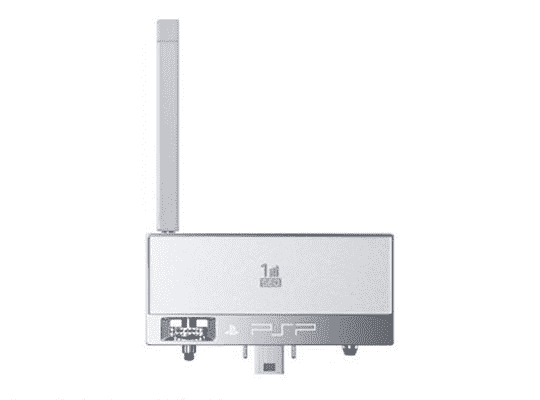

# PSP Slim 将推出数字电视调谐器

> 原文：<https://web.archive.org/web/http://techcrunch.com/2007/07/17/digital-tv-tuner-to-launch-with-psp-slim/>

# PSP Slim 将推出数字电视调谐器

在日本，一切都变得更酷、更好、充满触手可及，你将有在你的 PSP 上看电视的奢侈——至少在 9 月 20 日到来的时候。为了配合 PSP Slim 的推出，索尼将只在日本销售 1seg 数字电视调谐器插件。虽然它在质量上不是最好的，但它仍然是电视，让我想起了世嘉游戏装备的臭名昭著的电视调谐器配件。

棒极了。这个时候我会在日本，所以我会看看我是否能检查出这种体验实际上有多好。我说的“体验”是指打扰某个家伙让我看他的 PSP Slim 一个小时。生活在日本？想要在你的 PSP 上看电视吗？9 月 20 日 57 美元努夫说。

[日本 PSP Slims 获得数字电视](https://web.archive.org/web/20130628190453/http://kotaku.com/gaming/teh-future/japanese-psp-slims-getting-digital-tv-279114.php)【Kotaku】