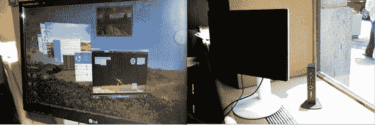

# DisplayLink + LG，通过 USB 发送视频信号，就像它过时了一样| TechCrunch

> 原文：<https://web.archive.org/web/http://techcrunch.com/2007/07/16/displaylink-lg-sending-video-signals-over-usb-like-its-going-out-of-style/>

# DisplayLink + LG，通过 USB 发送视频信号，就像它要过时了一样

通过 USB 发送视频监控信号？不，你不是在做一个遥不可及的梦，而是在看美国第一台通过 USB 电缆工作的显示器的照片。通过 Vista 认证的 LG L206WU 由 DisplayLink 的 DL-160 芯片供电，通过连接到任何 PC 的 USB 端口来工作。系统端软件将视频发送到显示器，由 DisplayLink 芯片进行所有处理。据说 Mac 版本正在开发中。

几天前我看到这个小数字展示，它确实像广告宣传的那样工作。Vista 的所有 Aero 效果都是通过 USB 实现的，所以你不会因为这个动作而牺牲视觉效果(或者分辨率——高达 1680×1050)。不建议使用这种设置玩视频游戏，但没有什么可以阻止你在 LG 显示器上运行 Office 或 Thunderbird 或任何东西。这看起来是一个无痛和简单的方式来添加一个额外的显示器到您的设置。还没有价格，奇科斯。

[显示链接](https://web.archive.org/web/20130628160044/http://www.displaylink.com/)