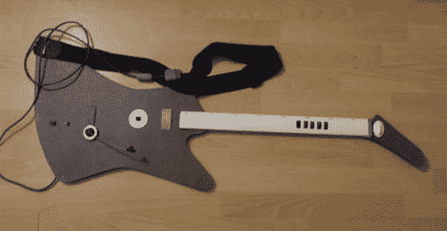

# DIY 吉他英雄控制器看起来不错

> 原文：<https://web.archive.org/web/http://techcrunch.com/2007/07/31/diy-guitar-hero-controller-looks-decent-sorta/>

# DIY 吉他英雄控制器看起来体面(排序)

有时候我们破产了，你知道吗:那没关系。我们都知道，连续三周吃拉面是值得的，这样我们就可以在 bong rips 之间连续几个小时玩 Playstation 3 游戏。因此，当一些狡猾的绅士在《吉他英雄 T2》中需要一个额外的控制器时，他就去找家用垃圾和一个 PS1 控制器。结果就是上图，Giz 觉得看起来丑得要命。我吗？这让我想起了《T3》里《T4》里的家伙们会用的吉他。我赞成。

[如何白手起家做出一把丑吉他英雄吉他](https://web.archive.org/web/20130628172039/http://gizmodo.com/gadgets/diy/how-to-make-an-ugly-guitar-hero-guitar-out-of-scratch-283986.php)【Gizmodo】