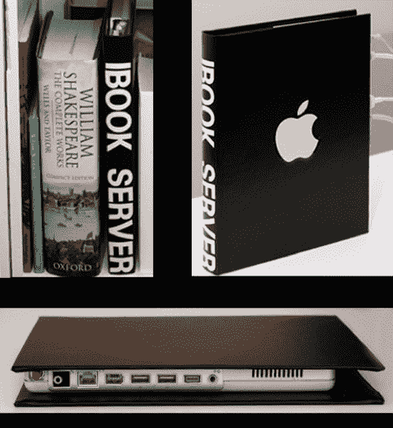

# DIY iBook 服务器手册| TechCrunch

> 原文：<https://web.archive.org/web/http://techcrunch.com/2007/07/05/diy-ibook-server-booklet/>

我的旧 Powerbook G4 显示器坏了，电池没了，键盘和鼠标也坏了。在把它作为外置硬盘使用了一段时间后，我以大约 200 美元的价格把它卖了，但现在我希望我做了这个家伙做的事情。乔纳斯有一台旧的 500Mhz 的 iBook 坏了，所以他取出电池和光驱，把它变成了一台工作服务器。

iBook 放在书皮里，可以很容易地藏在书架里。对于那些想要一台小型服务器而又不想向客人炫耀一大堆电线的人来说，这是一个完美的主意。这绝对是我见过的旧笔记本电脑的最佳实现之一。

[DIY iBook 服务器小册子](https://web.archive.org/web/20150920050824/http://www.makezine.com/blog/archive/2007/07/diy_ibook_server_booklet.html?CMP=OTC-0D6B48984890)【制作】