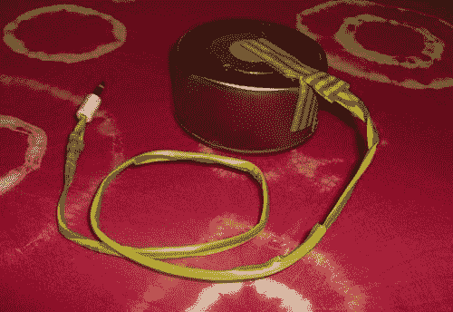

# DIY 铁罐麦克风 

> 原文：<https://web.archive.org/web/http://techcrunch.com/2007/01/19/diy-tin-can-mic/>

我怀疑你会在短期内把它添加到你的家庭录音棚设备中，但是它仍然很酷。这款麦克风由一个压电拾音器、1/8 英寸插孔和一个锡罐制成。我从来没有想过这个问题，但是，是的，我想这大概是人们所能制造的最简单的麦克风了。不知道麦克风的质量如何，但看起来它可以发出真正的复古声音。

[铁罐麦克风](https://web.archive.org/web/20221205120720/http://www.makezine.com/blog/archive/2007/01/tin_can_mic.html?CMP=OTC-0D6B48984890)【制造】