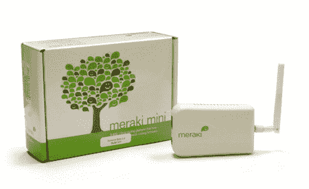

# DIY 无线 ISP 

> 原文：<https://web.archive.org/web/http://techcrunch.com:80/2006/08/14/do-it-yourself-internet-service-providing/>

曾经厌倦了你的网络连接吗？随机断开、糟糕的技术支持和奇怪的中断将成为过去！有了 Meraki，您现在可以经营自己的互联网服务提供商。Meraki 提供构建网状网络和提供互联网接入所需的软件、硬件和管理服务。这款设备将于 2006 年秋季上市，迷你版的建议价格为 49 美元。现在去参加测试吧，你知道你想的。

[产品页面【meraki.net ](https://web.archive.org/web/20140819004741/http://www.meraki.net/products.html)