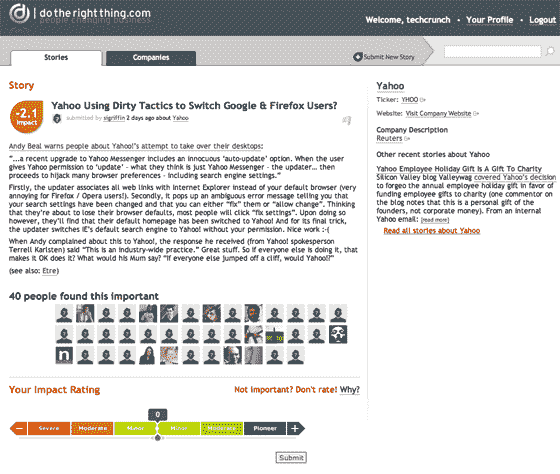

# 做自鸣得意的事情| TechCrunch

> 原文：<https://web.archive.org/web/http://www.techcrunch.com:80/2007/01/27/do-the-smug-thing/>

  今天晚上我看了看新创公司 [DoTheRightThing](https://web.archive.org/web/20230317082303/http://dotherightthing.com/) 。这是一个类似 Digg 的网站，人们在这里提交关于公司行为方式的故事，这些行为方式可以被认为是“好的”或“坏的”然后，其他用户对这些行为的好坏进行投票，添加评论等。计算并显示总体“良好”分数，范围从负面的“严重”到正面的“先锋”。

该公司希望各公司注意到这一点，意识到非财务结果对社会至关重要，并改变不良行为。由于他们有点虚伪地是一家盈利性的初创公司，他们希望在这个过程中也能赚一两美元。

正如你所料，该网站充斥着对沃尔玛和其他容易成为攻击目标的公司的典型抨击。一家苏格兰公司正受到攻击，因为他们将 scampi 运到泰国，在运回英国消费之前进行手工剥皮。一位用户表示:“这令人作呕”。另一方面，任何穿红色衣服和卖红色衣服的人都是受欢迎的，因为他们，显然只有他们，关心艾滋病患者。

一个被误导的用户发表了一个不太受欢迎的咆哮，建议公司不应该为世界上所有的问题负责。这个帖子目前的评分非常低。

我想这样的人会很快被赶出 dotherightthing.com，留下一群自鸣得意的丰田虔诚驾驶的行善者，通过齐声抱怨来解决我们所有的问题。

