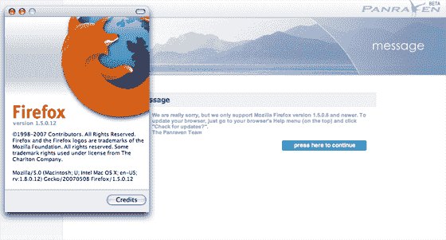

# 不要是这家公司| TechCrunch

> 原文：<https://web.archive.org/web/http://www.techcrunch.com:80/2007/06/18/dont-be-this-company/>

# 不要是这家公司

除非你同意不存在负面报道的理论，否则不要成为那种给我们发邮件，把他们的新产品和 Flickr 相提并论，但在邮件中拼写成“Flicker”的公司。不要给我们发送[链接](https://web.archive.org/web/20130628123926/http://www.panraven.com/visitor/VisitorViewStory.epage?sp=S100082)到显示完全错误的错误信息的产品。在这种情况下，链接上的消息说他们只支持火狐 1.5.0.8 和更高版本。我运行的是 1.5.0.12，这是 1.5 版本中的最新版本。

如果你还没有准备好让媒体关注你的产品，就不要接触媒体。并找出你声称要杀死的公司的正确拼法。