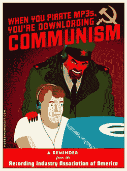

# 下载 MP3，被开除

> 原文：<https://web.archive.org/web/http://techcrunch.com/2007/06/07/download-an-mp3-get-expelled/>

像哥大和加州大学洛杉矶分校这样的大学最近受到了来自 RIAA T2 和众议院委员会的抨击，并被施压要求加大对非法下载音乐 T4 的惩罚力度。全美 19 所大学被迫接受了一项长达 6 页的调查，其中包含的问题有:“你们学校会开除违规学生吗？”。

在过去的 4 个月里，RIAA 已经参与了 1600 多起针对学生个人的诉讼，要求每个学生支付 3000 美元的版权侵权赔偿金。

这比起诉 10 岁女孩、残疾人和死者更进了一步。唱片业愿意做出一些妥协，给学生打折的订阅服务，但是，这不会让他们接触到广泛的音乐。

校园里的版权问题【华盛顿邮报】