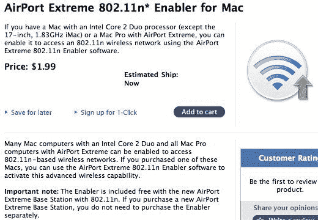

# 这家伙因为贴 Zune 海报在 SXSW 被抓了

> 原文：<https://web.archive.org/web/http://techcrunch.com:80/2007/03/15/dude-gets-busted-at-sxsw-for-putting-up-zune-posters/>

这是一个有点奇怪的情况。通常情况下，我会强烈反对警察逮捕在墙上张贴海报的人。没什么大不了的，在纽约的每个街区都能看到，对吧？这里的不同之处在于，这个贴海报的人是为微软工作的，他把 Zune 的海报扔得到处都是。过了一会儿，奥斯汀警察受够了他的 DRM-loaded hi-jinx，并以破坏公共财产的罪名逮捕了他，这可能只会导致埃德尔曼为他支付一大笔罚款。

虽然他可能会因为张贴 Zune 海报而坐牢…

[Zuned！奥斯汀警方在 SXSW](https://web.archive.org/web/20150924120245/http://www.losanjealous.com/2007/03/14/zuned-austin-pd-hauls-off-microsoft-street-spamers-at-sxsw/) 【洛杉矶 Anjealous】抓获微软街头垃圾邮件发送者