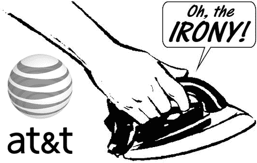

# 哥们怒斥美国电话电报公司的劣质服务:如果它跑了我们的高速公路怎么办？

> 原文：<https://web.archive.org/web/http://techcrunch.com/2007/07/30/dude-rants-about-atts-shoddy-service-what-if-it-ran-our-highwayszomg/>

LOL！这是我唯一能打出来的东西，更不用说说了，在读完这篇令人愉快的小文章后，我想象了一个世界，在这个世界里[在& T](https://web.archive.org/web/20150522214135/http://crunchgear.com/category/att/) 跑高速公路。你知道，真正的汽车高速公路，而不是信息超级++之一。真的真的很搞笑。宝石包括:

美国电话电报公司将以 3.99 美元的价格提供喇叭音调。不允许音乐从汽车的点唱机传输到喇叭音调存储芯片。

开车超出美国电话电报公司高速公路网络的覆盖范围会产生漫游费。

美国电话电报公司批准的苹果 iCar 最高时速将被限制在 30 英里。美国电话电报公司汽车展厅的销售人员根本不知道 iCar 是如何运作的。

美国电话电报公司的道路将采用浮动限速。在某些情况下，速度限制的降低将与道路上的交通相对应；在其他情况下，速度限制会莫名其妙地下降。张贴的限速与实际限速不符。

美国电话电报公司的许多道路将由泥土建成，尽管美国电话电报公司获得了税收抵免以铺设道路。

嗯。我们明白了。你不喜欢 AT&T。

你知道他让我想起了谁吗？《辛普森一家》剧集《丽莎先生去华盛顿》中模仿马克·拉塞尔的家伙赤字抹布，哦耶赤字抹布…

[如果在& T 跑高速公路系统…](https://web.archive.org/web/20150522214135/http://www.informationweek.com/blog/main/archives/2007/07/if_att_ran_the.html;jsessionid=JBKF53ESQRSE4QSNDLPSKH0CJUNN2JVN) 【信息周刊】