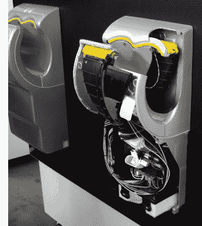
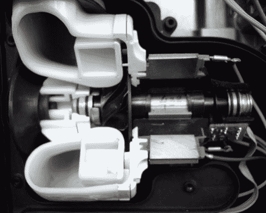
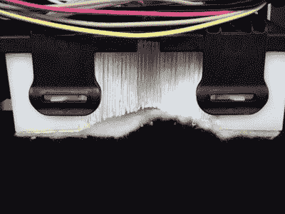
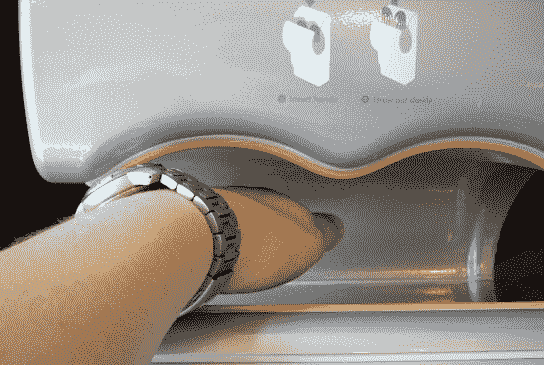
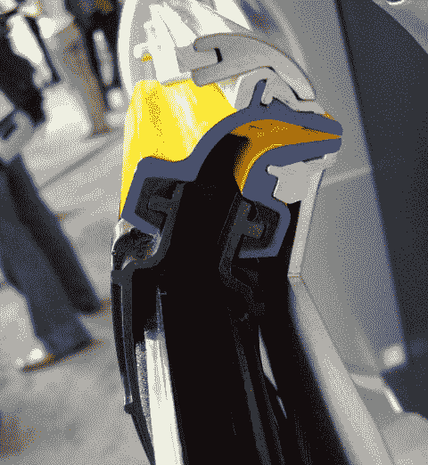

# Dyson Airblade:不吸，只吹

> 原文：<https://web.archive.org/web/http://techcrunch.com:80/2007/06/26/dyson-airblade-no-sucking-just-blowing/>

戴森今天宣布在美国推出 Dyson Airblade，这是市场上最快、最卫生的干手器，解决了洗手间用户的一个问题。这里有一段视频可以证明。对不起，我有点发抖，但是你仍然可以看到詹姆斯·戴森爵士展示他的神奇的吹风机。(只为我们的读者提供优质内容！)

不过说真的，这个东西确实很好用，基本上几秒钟就能把手上的水擦掉，让每个角落都保持干燥。点击前方，阅读在您的建筑中安装这款价值 1400 美元的干手器的好处，并查看 Airblade 内部的一些热辣图片。

马达。

速度:
Dyson Airblade 利用 DDM 产生 400 英里/小时的清洁气流，吹过一个不比睫毛厚的缝隙。这片空气就像一个无形的挡风玻璃刮水器，擦去手上的水分，让手在 12 秒内完全干燥——比任何其他干手器快了整整 10 秒。

消费者调查发现，近十分之六的受访者更喜欢使用纸巾，而不是电热烘干机。他们避免使用干手器的两个主要原因是，干手器用的时间太长(69%)和干手不合适(49%)。

HEPA 滤波器。
卫生:
传统的干手器只是简单地吸入卫生间的脏空气，加热后吹到手上，使手变得潮湿，更容易传播细菌。潮湿的手传播的细菌比干燥的手多 1000 倍。Dyson Airblade 使用 HEPA 过滤器从用于干燥双手的空气中去除超过 99.9%的细菌。它还具有无接触红外传感器技术和抗菌添加剂涂层，以减少细菌和真菌的生长。

NSF 国际研究发现，纸巾分配器是浴室中平均每平方英寸有 1000 到 10000 个细菌的物品。特别是，纸巾单元的分配槽很少被清洗。在总数的大约 4%的表面上检测到金黄色葡萄球菌，在纸巾分配器上有高浓度。

你可以看到从气刃(下图)出来的气的力量强大到足以让我手上的肉缩进去。

节能:
戴森 Airblade 比传统干手器节省高达 80%的能源。DDM 是一种小型、长寿命、低能耗的无刷电机，转速为每秒 1666 转。DDM 为 Dyson Airblade 产生足够的气压，无需加热即可干燥双手。

成本:Dyson Airblade 每天使用 500 次，一年的运营成本不到 100 美元，而传统干手器的运营成本为 400-450 美元。使用纸巾操作洗手间的成本可能是使用 Dyson Airblade 的 50 倍以上。

Dyson Airblade 正在 AMC 影院和美国其他地方使用。售价 1400 美元。要了解更多关于戴森 Airblade 的信息，请访问 http://www.dysonairblade.com。