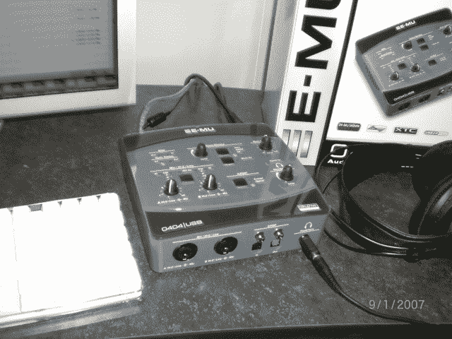

# e-MU 0404 audio pod–TechCrunch

> 原文：<https://web.archive.org/web/http://techcrunch.com:80/2007/01/10/e-mu-0404-audiopod/>

E-MU 404 AudioPod 是一款新的 USB 2.0 音频/MIDI 接口，带有 24 位模数和数模转换器以及 XTC 麦克风/线路/hi-Z 前置放大器。您不仅可以从 0404 AudioPod 中获得出色的声音，还可以将热信号传输到像带上，而不必担心会削波轨道。XTC A 级超低噪声前置放大器将允许您将麦克风、键盘、吉他、MIDI 控制器和任何其他 MIDI 设备插入您的数字工作站/笔记本电脑/台式机，前置放大器将为您提供出色的声音。

你还将获得低延迟 USB 2.0 驱动程序，这样你发送到 type 的信号的时间将会非常准确。您还可以在立体声和单声道中获得零延迟直接监听，这保证了您在录制或进行过度配音时不会有延迟。0404 AudioPod 捆绑了 Sonar LE、Cubase LE、Abelton Live Lite 4、WaveLab Lite、Melodyne 和其他一些应用程序和插件。如果你有一台 Mac，不要担心，0404 也兼容 OS x。0404 的价格很便宜，为 199 美元(在相同输入量的情况下，低于 MBox 2)，所以如果你一直在寻找一个新的音频/MIDI 接口，请检查一下。

哦，是的，请原谅我照片上的日期。我的卡西欧已经决定我活在未来。

[E-MU 0404 AudioPod](https://web.archive.org/web/20210307095235/http://www.emu.com/products/product.asp?category=610&subcategory=611&product=15185) 【产品页面】