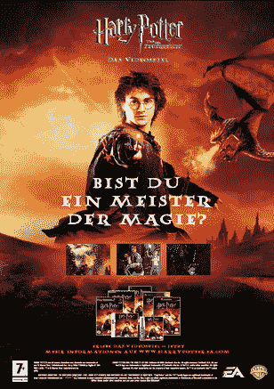

# 艺电表示游戏需要创新，发布“游戏需要创新 2007”，即将推出“游戏需要创新 2008”| TechCrunch

> 原文：<https://web.archive.org/web/http://techcrunch.com/2007/07/09/ea-says-games-need-to-innovate-releases-games-need-to-innovate-2007-soon-to-launch-games-need-to-innovate-2008/>

“我们把人烦死了，制作越来越难玩的游戏。”这是艺电首席执行官约翰·里奇泰洛对《华尔街日报》说的话。唱出来，强尼。

EA，推出无聊和硬视频游戏的国王，试图从特许经营权和蹩脚电影中赚钱，终于看到了光明。他的批评并无新意。从 T2 的皮特·莫利纽克斯到新泽西特伦顿 GameStop 外的醉汉，每个人都在抱怨无聊的电子游戏。然而，里奇泰洛提到它就像麦当劳随便提到快餐是蹩脚的。

> “在很大程度上，这个行业一直在清洗和重复，”他说。“有很多产品看起来像去年的产品，也很像前年的产品。”

那么，大牌明星这样抱怨对这个行业意味着什么，尤其是在 E3 赛季期间？真的不多，但正如我们从 Wii 上看到的，休闲游戏市场是巨大的，而且还在增长。这个行业可以创造出巨大的电影游戏，但却停留在相同的模式中——即使是 *[黑暗](https://web.archive.org/web/20150928191005/http://www.2kgames.com/thedarkness/)* 对非*黑暗*粉丝来说也没有多大意义。旧的“许可一个 3D 建模系统，制作一个有女巫或机器人或其他东西的游戏，然后卖掉它”不再管用了。像*塞尔达*和*失落星球*这样的游戏有它们的位置，但事情需要改变。我唯一担心的是，我们只会得到更多的俄罗斯方块克隆版，而不是更少的公民凯恩。

有趣的是，当我看到创造“休闲”游戏的动力时，我想知道移动游戏的兴起和实际上有现金并在 Atari 2600 周围的老年铁杆游戏玩家的老龄化是否改变了行业的动态。很明显，有十亿更小的孩子乐于观看一些漂亮的图片，但是那些既没有时间也没有精力去寻找塞尔达传说中每一只蚂蚁的人呢？你怎么想？

[艺电首席执行官称需要更多创新游戏](https://web.archive.org/web/20150928191005/http://online.wsj.com/article/SB118387245259860156.html)