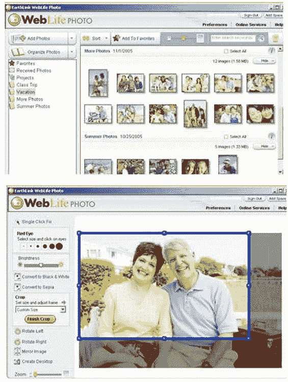
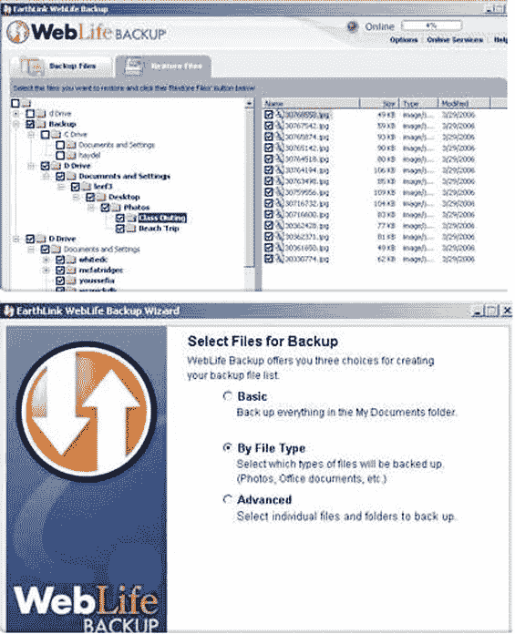

# Earthlink 推出新的照片和存储服务

> 原文：<https://web.archive.org/web/http://www.techcrunch.com:80/2006/07/15/earthlink-rolls-out-new-photo-and-storage-service/>

  上周 Earthlink [发布了](https://web.archive.org/web/20160528194236/http://www.techcrunch.com/2006/07/13/when-did-earthlink-get-so-cool/)一款免费的在线 RSS 阅读器和一个社会化书签网站。最近，有消息透露(Earthlink 实际上是在 6 月份在他们的博客上悄悄宣布的,)一个更加雄心勃勃的项目，叫做 [WebLife](https://web.archive.org/web/20160528194236/https://weblife.earthlink.net/) ,也已经上线。

WebLife 是两种服务的结合:照片管理和分享，以及在线存储/备份。基本服务允许 1 GB 的存储空间，对 Earthlink ISP 客户免费。其他人可以以 3 美元/月的价格访问它。额外存储每月每 GB 1 美元。

该服务需要 10 MB 的下载空间。Earthlink 客户服务证实，Weblife 有该软件的 Mac 版本，但该网站上只有 Windows 版本。说句题外话，这绝对是糟糕的客户服务。我必须支付服务费用(并同意每月重复付费)，然后才能访问下载区，并看到没有 Mac 版本。Earthlink 的客户服务就像当年我为了终止我的 ISP 帐号而和他们斗争的时候一样糟糕。天知道我怎样才能在不终止我的信用卡的情况下取消这个月费。

**网络生活照片**

这项服务类似于谷歌新推出的 Picasa 软件，拥有管理和编辑照片的桌面软件，以及将精选照片发布到网络上的能力。现在标准的服务，如照片打印也包括在内。

**网络生活备份和网络生活磁盘**

WebLife Backup 和 WebLife Disk 是相当先进的在线存储数据的工具。

备份服务允许自动备份整个硬盘驱动器，选择文件夹或某些文件类型(MP3 等)。).文件也可以选择加密。

磁盘产品是一个简单的在线存储工具，类似于我们过去对的描述。

**总结**

我的印象是，这些是一套有用的服务，可能会吸引数百万现有的 Earthlink 客户。相对于一些在线存储的竞争对手和由 T2 亚马逊 S3 设立的新标准来说，它的价格很高，但是它与桌面客户端的结合非常好，可以方便地管理照片和数据存储。然而，他们需要清理他们的客户服务列车残骸，并发布该软件的 Mac 版本。