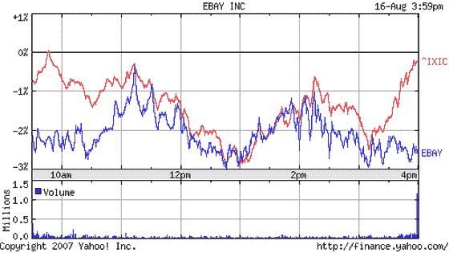

# EBay 市值缩水 10 亿美元；Skype 继续中断 

> 原文：<https://web.archive.org/web/http://www.techcrunch.com:80/2007/08/16/ebay-sees-1-billion-knocked-off-market-cap-as-skype-outages-continue/>

# EBay 市值缩水 10 亿美元；Skype 中断仍在继续

总的来说，这是股票市场不景气的一天，但易贝却遭受了双重打击。

尽管纳斯达克上市股票尾盘有所反弹，但易贝股票周四收盘下跌 2.58%(89 美分)。这一下跌使易贝市值缩水 10 亿多美元，此前一天，易贝的网络电话提供商 Skype 因[系统范围的中断](https://web.archive.org/web/20221021232039/http://www.beta.techcrunch.com/2007/08/16/skype-suffers-major-outage/)而陷入瘫痪。

Skype 服务中断现在已经接近 18 个小时了(在撰写本文时),除了这个问题与“登录问题”有关之外，Skype 几乎没有提供任何信息 Skype 在当天早些时候被迫[否认谣言](https://web.archive.org/web/20221021232039/http://heartbeat.skype.com/2007/08/the_latest_on_the_skype_signon.html)他们的平台已经被黑客攻击或受到网络攻击。

一些用户报告说 Skype 服务时断时续，几分钟后连接中断。