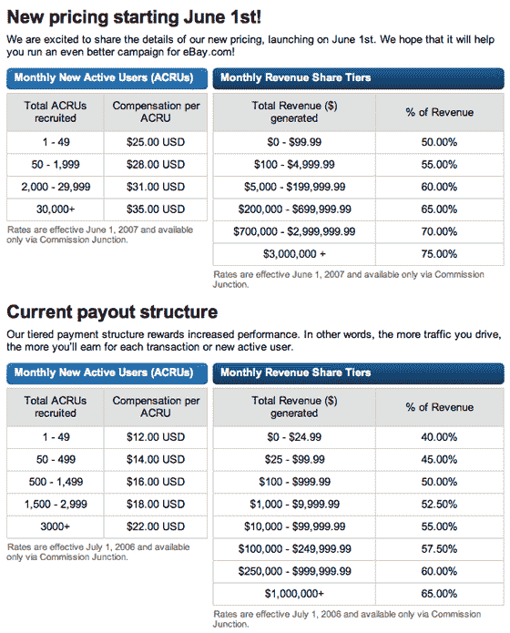

# 易贝将于 6 月 1 日提高代销商支出

> 原文：<https://web.archive.org/web/http://www.techcrunch.com:80/2007/05/15/ebay-to-increase-affiliate-payouts-on-june-1/>

 易贝于 2007 年 6 月 1 日大幅提高了关联公司的奖金。对于较小的分支机构，新客户注册的收益将超过 2 倍，收入份额将增加 25%。当前和新的会员费都列在这里，我已经把它们贴在下面了。

对于直接或间接从易贝会员费中赚取收入的初创公司来说，这是一个好消息，它可能会鼓励其他电子商务网站也增加自己的支出。

易贝没有对他们为什么提高利率做出任何声明。尽管康姆斯克在过去的 12 个月里表现平平，页面浏览量下降，但他们的收入却逐年增长。他们的股票价格也呈下降趋势。让新用户加入这项服务是当务之急，他们的联盟网络远比标准广告更有效率。

