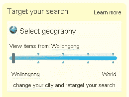
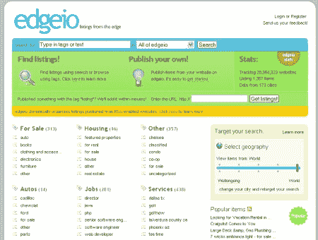

# Edgeio 推出 TechCrunch

> 原文：<https://web.archive.org/web/http://www.techcrunch.com/2006/02/27/edgeio-launches/>

经过一段时间的期待和对私人观众的开放，T2 的团队今晚揭开了他们创作的封面，并向公众发布。Edgeio 从支持 RSS 的来源获取列表(分类广告),并将它们组织在一个中心位置，以便用户能够浏览和搜索。Edgeio 的理念是内容属于边缘，这也是名称的来源(边缘输入/输出)。边缘内容是指数百万博客和其他网站上的内容，Edgeio 在聚合和组织这些内容方面做得很好。

从卖家的角度来看，发布一件你写在博客上的商品，并将其标记为“列表”(以及任何其他适合对该商品进行分类的关键词)。Edgeio 通过 weblogs.com 和其他 ping 服务接入博客云(以及它自己的 ping 服务器，该服务器位于[http://www.edgeio.com/RPC2](https://web.archive.org/web/20221003083048/http://www.edgeio.com/RPC2))来寻找已经被标记为上市的新帖子。一旦它找到你的帖子，这通常会很快发生，它会向你的帖子发送一条 trackback，让你知道 Edgeio 已经找到了它。一旦你发帖，第一次发帖时，你需要去 Edgeio 申请你的博客(这个过程类似于 Technorati 的),从这里你可以在 Edgeio 中为你的列表添加额外的元数据。您输入的附加数据包括对商品进行分类的附加标签、您的地理位置(您只需输入一次，在您搜索要购买的商品时也会用到)以及商品的价格。从你发布你的列表到它出现在 Edgeio 上并可供买家找到只需要几分钟的时间。

从买家的角度来看，你可以去 Edgeio，然后通过多种方式找到待售商品。第一种也是最明显的方法是在搜索框中输入术语。这将显示按时间顺序排序的项目摘要结果。查找项目的另一种方法是浏览位于首页的标签簇，然后找到您感兴趣的项目。你可以找到条目的最后一种方式很有趣，因为 Edgeio 有最受欢迎的条目、最新的条目和最活跃的博客发布条目的列表。流行项目列表和最新项目列表具有可供用户订阅或在其他应用程序中使用的提要。你注意到的一件很酷的事情是，当你浏览项目时，地理滑块窗口小部件一直在侧边栏中。如果您正在查看搜索结果，并希望将它们过滤到您所在的州或您所在的邮政编码，那么您只需滑动滑块。有人告诉我，这个滑块在不久的将来会更加精细，给出“滑动点”，即当前点周围的特定距离半径(例如，在您当前邮政编码的 10 英里以内)。滑块工作和自动刷新结果或页面的方式已经被很好地实现了，并且很有意义。界面做得非常好，干净且易于理解(我通过将 URL 交给非技术用户进行测试，他们能够找到可能感兴趣的列表)。

在整个搜索结果中，已被认领的博客列表优先于未被认领的列表。将来，卖家将能够以很少的费用来突出显示他们的列表。信誉目前通过第三方网站处理，卖家可以选择将他们的列表与他们的 Flickr，易贝或 LinkedIn 帐户相关联，以便可以追溯他们的可信度。目前看来，Edgeio 上的许多交易将是面对面的交易，验证可信度与向外国或其他州的陌生人付款不同。

Edgeio 的全部意义在于通过其聚合列表的平台连接买家和卖家，因此目前没有支付选项，你也无法看到买家或卖家之前购买或出售的任何账户历史。目前这是留给买方和卖方来完成交易。Edgeio 还提供了许多社交控件，作为保持列表相关和最新的手段。用户可以通过告诉 Edgeio 该项目是垃圾邮件，它不再是最新的，它没有被正确分类，或者出版商的信息不准确，来将列表标记为“坏的”。这些形式的社交控制和过滤在 Craigslist 等网站上运行良好，它们对 Edgeio 的影响以及它们在防止垃圾邮件方面的效果如何，只有假以时日才能知晓。

Edgeio 的一个重要方面是系统每个部分的提要的可用性。有了标准的 RSS 订阅源( [Dave Winer](https://web.archive.org/web/20221003083048/http://www.scripting.com/) 是该公司的顾问)，其他应用程序的开发人员或网站管理员能够将 Edgio 上的待售商品包含到他们自己的网站或应用程序中，或者以某种混搭的形式将列表进一步扩展(我猜我们将很快看到第一批混搭——可能是谷歌地图)。我喜欢能够订阅 feed 的想法，它将显示现在可能不可用的新项目，但我希望购买-所以我会在它们发布后立即看到它们。

我赞同这样的理论:内容的发布和控制属于用户，我们正朝着这个方向前进。这有几个原因，第一个也是最重要的原因是，用户拥有他或她的数据，即使是像分类列表这样简单的东西，因此用户应该能够有效地控制包含这些数据的环境。有了像易贝和 T2 这样的集中服务，买家和卖家就只能任由平台提供商摆布了。博客使用户能够轻松地创建内容并将其发布在网络上，因此使用该平台进行列表只是可以建立在我们今天所拥有的基础上的许多潜在服务之一。我预测的短期障碍是这个市场目前的规模，以及 Edgeio 将如何有效地宣传自己是上市的标准场所。就可伸缩性而言，只有大得多的库存才能测试将标签和标签簇作为目录的理论，而不是僵化的目录结构(很难维护和扩展)。Edgeio 正在将分类和类别本身交给用户，让他们进行自我监控，试图确保事情不会失控。虽然在推出时有 1300 个左右的列表是一个好的开始，但市场的规模和博客上的列表数量不会很快与易贝或 Craigslist 相比(尽管 Edgeio 也可以使用其他目录作为来源，使其成为一个分类广告元网站)。

从长远来看，这是一个绝好的机会，尤其是因为普通网络用户越来越多地可以根据自己的意愿在网上发布内容(随着 MySpace 和 MSN spaces 等服务的出现，用户数量越来越多)。Edgeio 是一个非常开放的平台，他们希望其他人构建应用程序，并在其他网站和应用程序中使用列表内容。我确信，无论 Edgeio 是否成功，其更传统的竞争对手都不得不考虑他们自己的政策，提供 feeds 和其他开放措施，我希望 Edgeio 的推出可以刺激其他平台的变化。

Edgeio 是由 Keith Teare(easy net 和 Realnames)和 T2(Techcrunch)以及由马特·考夫曼(the 和 Realnames)和维达尔·霍克斯塔德(Yahoo！欧洲)。Edgeio 已经从众多投资者那里筹集了 150 万美元的天使资本，这些投资者包括路易斯·莫尼耶、弗兰克·考菲尔德、奥兰·霍夫曼、RSS 投资者基金、[杰夫·克拉维尔](https://web.archive.org/web/20221003083048/http://blog.softtechvc.com/)、罗恩·康韦和迈克尔·坦纳。

Edgeio 将需要克服这些障碍，并让越来越多的卖家采用他们正在推动的模式(即“列表”标签)。他们正在朝着正确的方向前进，拥有非常好的界面和一些非常酷的功能，以及实现这一目标的意愿和正确的人。Om Malik 也报道了这次发射。

 *免责声明:Mike Arrington，Edgeio 的创始人之一，也是本博客的创始人。本文中表达的所有观点均为作者([尼克·库布里洛维奇](https://web.archive.org/web/20221003083048/http://www.nik.com.au/) )* 的观点