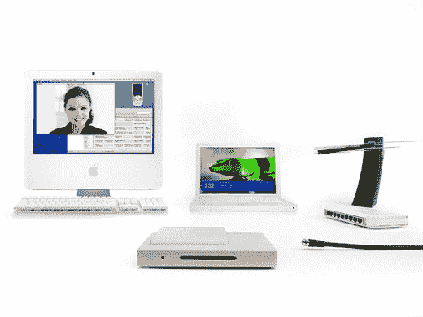
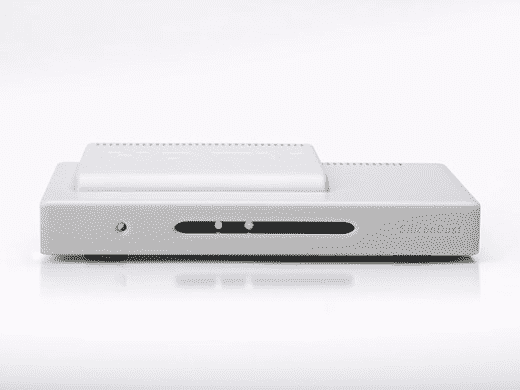
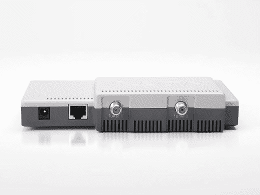

# Elgato 的 hdhome run:Mac 上的高清电视| TechCrunch

> 原文：<https://web.archive.org/web/http://techcrunch.com:80/2007/07/24/elgatos-hdhomerun-hdtv-on-your-mac/>

在巨大的 70 英寸等离子显示器上观看无线高清电视是一回事，但在你的 MacBook 或 iMac(或你附近的任何其他 Mac)上观看这样的节目则完全是另一回事。Elgato 的 Mac 专用 HDHomeRun 将数字电视调谐器和 EyeTV 软件结合在一个智能(如果不是很有名的话)包中。请注意，你需要提供自己的 ATSC 天线或未加密的有线电视连接才能工作，但一旦你这样做了，你就会置身于高清天堂，前提是你的处理器能够应对挑战。(为了能够观看 720p 或 1080i 节目，您需要一台基于双 G5 或英特尔酷睿 2 双核处理器的 Mac。)HDHomeRun 是网络兼容的，这意味着如果你进行适当的设置，你就可以在任何联网的 MAC 电脑上观看高清内容。相当酷。

EyeTV 软件的功能和其他 DVR 一样:暂停、倒带、快进直播电视；把所有的东西都记录到你的硬盘上，以便以后查看；画中画；屏幕节目指南等。整整九码。我认为 199 美元可能有点贵，但实际上你花了这么多钱得到了一个不错的套餐。高清录制高清网络或 ESPN 的能力对我来说非常有吸引力。我肯定不是唯一一个认为每周 7 天每天 24 小时观看“地球日出”会给公寓氛围带来奇迹的人吧？

[hdhome run](https://web.archive.org/web/20160423062050/http://www.elgato.com/index.php?file=products_hdhomerun)【Elgato 系统通过 [MacMinute](https://web.archive.org/web/20160423062050/http://www.macminute.com/2007/07/24/hdhomerun/)