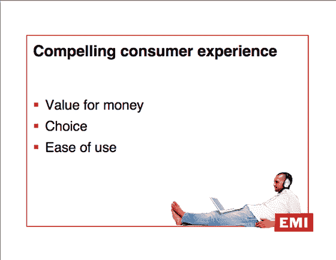
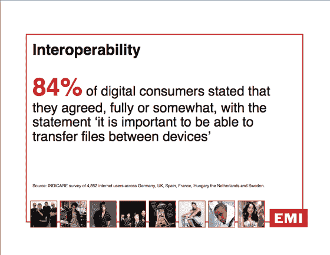
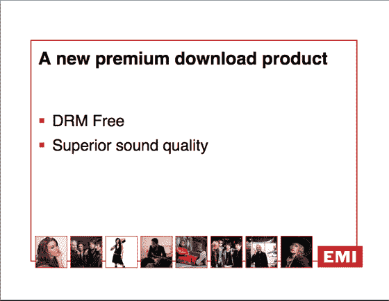
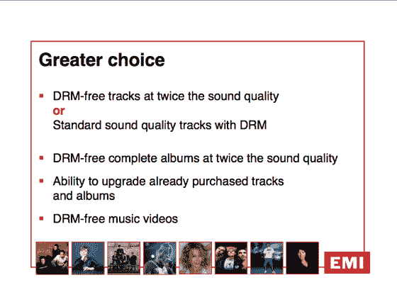
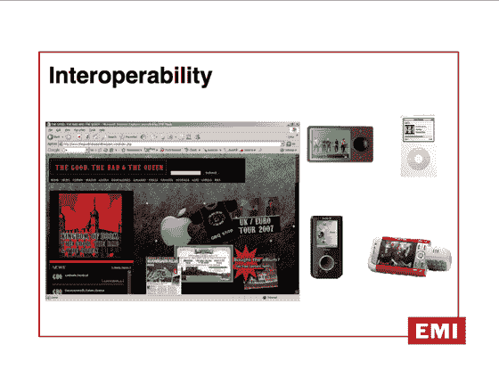

# 百代、苹果将以 1.29 美元/首的价格出售无数字版权管理的音乐

> 原文：<https://web.archive.org/web/http://www.techcrunch.com:80/2007/04/02/emi-apple-are-announcing-sale-of-non-drm-music/>

***更新:**按下调用的 MP3 文件是[这里的](https://web.archive.org/web/20230326025051/http://cache.cantos.com/mp3/pjx-d254/pjx-d254_v2_MP3.mp3)。*

2007 年 4 月 2 日:DRM 去世的日子。

今天，EMI 首席执行官埃里克·尼科利和苹果首席执行官史蒂夫·乔布斯在伦敦举行的令人惊讶的新闻发布会在几分钟前(伦敦时间下午 1 点)刚刚开始。正如预期的那样，这两家公司将在 iTunes 上提供百代的数字目录 DRM-free。

我们正在通过网络直播收听新闻发布会(还有 [CrunchGear](https://web.archive.org/web/20230326025051/http://crunchgear.com/2007/04/02/emijobs-keynote-live-notes/#more-5386) )。随下面的幻灯片一起分发的还有一个 PDF。
 **我们从出版社调用**

百代将从其数字目录中提供所有没有 DRM 的歌曲。今年早些时候的测试表明，人们更喜欢 10:1 的非 DRM 曲目。iTunes 是第一个合作伙伴。

这些歌曲将不再与 iTunes 和 iPod 绑定——任何播放 AAC 格式的设备都将播放这些歌曲。

歌曲将以 256kbps AAC 编码(目前是 128kbps)，并以每首 1.29 美元的**价格出售，比当前价格多 0.30 美元。这些将与现有的低质量 DRM 音轨一起提供，消费者可以选择。**

整张专辑的购买价格将保持不变，但具有更高的音频质量，并且没有数字版权管理。

百代音乐视频将免费提供数字版权管理，价格不变。

之前购买曲目的客户可以升级到 DRM 免费曲目，每首曲目 0.30 美元。

乔布斯说，他们正试图与其他唱片公司做类似的交易，并预计到今年年底，他们销售的所有歌曲中有 50%将是无 DRM 的。

史蒂夫·乔布斯说，他们提供给人们的只是他们直接购买 cd 并翻录后得到的东西。

这里的新闻稿是[这里的](https://web.archive.org/web/20230326025051/http://www.emigroup.com/Press/2007/press18.htm)。

**幻灯片从** 按下调用

