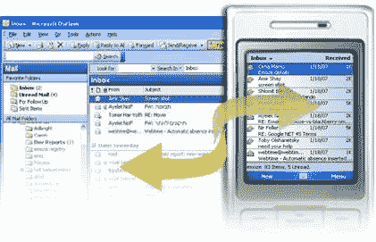

# EMoze:免费推送电子邮件

> 原文：<https://web.archive.org/web/http://techcrunch.com:80/2007/03/20/emoze-push-email-for-free/>

对于那些仍然坚持并拒绝接受公司发行的黑莓手机的商人来说，Emoze 是一个梦想成真。Emoze 声称，免费的电子邮件推送服务可以在任何具有电子邮件功能的手机上运行。它甚至可以在公司防火墙后工作，具有军用级别的加密，并且被设计为支持所有的蜂窝和无线网络。那么它是如何工作的呢？

根据想象图，Emoze 由三个建筑组成:
1。emoze PC 连接器
2。Emoze 全球服务网络(EGSN)
3。emoze 移动客户端

Emoze PC Connector 是一款可以安装在任何基于 Windows 的 PC(公司或个人)上的应用程序，它经过优化，可以与 Microsoft Exchange Server 或任何 POP3/IMAP 邮件服务器配合使用。

Emoze 全球服务网络是一个全球可访问的网络，它通过一个 PC 连接器管理与各种运营商和网络的多个连接。将支持 CDMA、GPRS、1xEV-DO、UMTS、Wi-Fi 和任何未来的网络。

Emoze 移动客户端是一个与 EGSN 同步的移动应用程序，可以获取你所有的重要电子邮件。

Emoze 目前只与 Windows 兼容，但 Mac OS 的兼容性正在研究中。如果你正在阅读 MobileCrunch，那么你的设备操作系统和邮件应用程序很有可能是合格的。我说过它是完全免费的吗？

[产品页面](https://web.archive.org/web/20160407222507/http://www.emoze.com/en/download/Default.aspx)