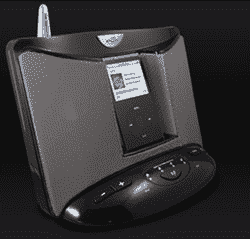

# EOS 无线 iPod 系统:不要与合适的音响系统混淆

> 原文：<https://web.archive.org/web/http://techcrunch.com/2007/07/06/eos-wireless-ipod-system-not-to-be-confused-with-a-proper-sound-system/>

猴子看，猴子做。每个人和他们的母亲(笑出声来！)将推出无线 iPod 音响系统，Intellitouch 是最新一家在这方面想要你的钱的公司。它的 Eos iPod dock 可以在室内 150 英尺的范围内无线传输你的夏日节拍；户外范围神奇地扩大了一倍。dock 能够同时向四个扬声器发送音乐，并使用所有技术来保持保真度，如 SRS WOW 和低音增强。

Eos 售价 300 美元，额外的扬声器售价 150 美元。哦，Intellitouch 希望[提醒你](https://web.archive.org/web/20131230223920/http://www.eoswireless.com/eos-wireless-speaker-blog/?postid=13)“Eos 是作为一个环境音乐系统而设计的，而不是取代你的家庭立体声系统。”对你的产品有信心，对吗？

[产品页面](https://web.archive.org/web/20131230223920/http://www.eoswireless.com/eos_wireless_home_audio.html)【EOS via[电子屋](https://web.archive.org/web/20131230223920/http://www.electronichouse.com/article/intellitouchs_eos_sends_ipod_tunes_throughout_the_home/C157)