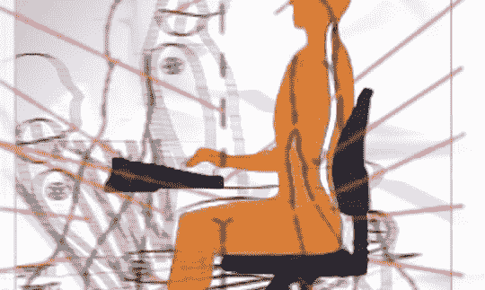

# CrunchGear 的人体工程学综述–TechCrunch

> 原文：<https://web.archive.org/web/http://www.techcrunch.com:80/2006/12/29/ergonomic-roundup-at-crunchgear/>

# CrunchGear 的人体工程学综述

作为技术人员，很少有组件像椅子一样对我们的身体产生如此大的影响。每天坐在椅子上无数个小时对我们的身体有显著的影响。一把蹩脚的椅子会造成即刻的压力，还会导致长时间的疼痛。然而，一把高质量的椅子可以给你带来很多好处。认识到这一困境，CrunchGear 在一篇名为[工作空间综述:人体工程学椅子](https://web.archive.org/web/20220816102410/http://crunchgear.com/2006/12/28/workspace-roundup-ergonomic-chairs/)的文章中对目前可用的几种顶级人体工程学选项进行了压力测试综述。