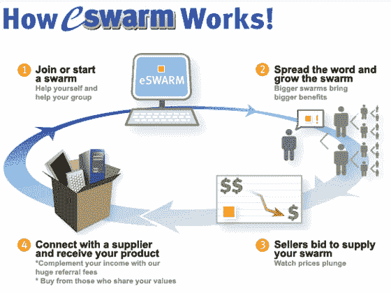

# eSwarm:在线团购——TechCrunch

> 原文：<https://web.archive.org/web/http://www.techcrunch.com:80/2007/07/28/eswarm-group-buying-online/>

# eSwarm:在线团购

总部位于科罗拉多州博尔德的 eSwarm 旨在通过一种类似于大宗购买俱乐部的模式将买家和卖家联系在一起。

买家注册一个免费账户，然后加入当前的买家群或创建新的买家群。群体可以专注于任何消费品、债务再融资、预付费礼品卡和借记卡，甚至保险产品。然后，卖家出价购买该业务。

该理论认为，蜂群越大，对卖家越有吸引力。一旦卖家提交第一次出价，该群体的成员资格将被冻结，其他商家有 48 小时的时间来还价。

eSwarm 还为慈善机构和组织提供筹款工具；群体的创建者可以规定将总销售额的一定比例捐赠给他们选择的慈善机构。

该网站目前还没有太多的活动，但它正在增长。首席执行官 Tim Newcomb 说，eSwarm 是一场“全球经济革命不是，但确实有潜力。

 