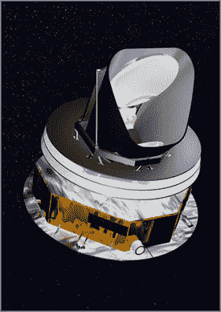

# 欧洲卫星揭开宇宙之谜

> 原文：<https://web.archive.org/web/http://techcrunch.com/2006/10/04/european-satellite-to-solve-mysteries-of-the-universe/>

到现在为止，你可能已经听说了两个美国人，约翰·C·马瑟和乔治·f·斯穆特，因为他们在美国宇航局宇宙背景探测器(COBE)卫星上的工作而被授予诺贝尔物理学奖。我们为他们感到骄傲，加油团队，耶。但是紧随其后的是那些疯狂的欧洲人和他们的新卫星。它名为普朗克，计划于 2008 年发射，建立在马瑟和斯穆特的工作基础上。它将试图回答 COBE 留下的一些关于宇宙起源的未解问题，例如宇宙是否在大爆炸后不久经历了一段突然的指数膨胀期。新卫星的灵敏度是 COBE 的十倍，角分辨率是 COBE 的五十多倍，这使它比 COBE 强大 1000 倍。小心宇宙，欧元来了。

[欧空局的普朗克卫星建立在获得诺贝尔奖的科学基础上](https://web.archive.org/web/20151006222643/http://www.eurekalert.org/pub_releases/2006-10/esa-eps100406.php)