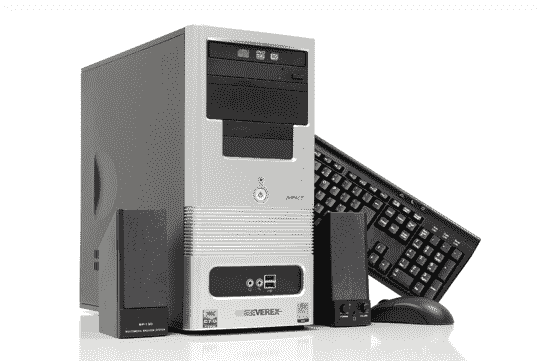

# Everex 推出低于 300 美元的绿色电脑| TechCrunch

> 原文：<https://web.archive.org/web/http://techcrunch.com/2007/07/18/everex-sub-300-green-pc-launches/>

当你今天走进沃尔玛去买一些便宜的药品和大量的卫生纸时，你可能会注意到在电子产品区有一台新的个人电脑出售。Everex 发布了 Impact GC3502，这是一款新的 298 美元的“绿色”电脑，由于采用了 1.5GHz 的 C7-D 处理器，它最多使用 20W 的功率。你不会在这个系统中找到任何刺激，尽管它不一定是一堆垃圾。包括大量 1GB 的 RAM，以及 OpenOffice、80GB 硬盘、DVD/CD-RW [组合驱动器](https://web.archive.org/web/20160220092942/http://crunchgear.com/2007/07/18/i-o-data-slim-dvd-burner-announced/)和 Windows Vista Home Basic。

不要指望在这台电脑上运行任何游戏。它是为精打细算的学生或需要文字处理和互联网浏览等基本功能的计算机用户设计的。没有字，如果你有一个显示器与这个“绿色”电脑，虽然我敢猜测，你没有。

[Everex 推出售价 298 美元的绿色电脑 OpenOffice](https://web.archive.org/web/20160220092942/http://www.electronista.com/articles/07/07/18/everex.gc3502/)