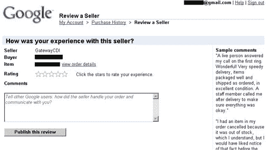
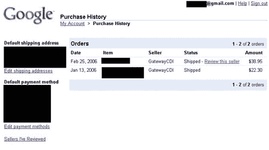

# 独家:谷歌支付卖家信誉截图 TechCrunch

> 原文：<https://web.archive.org/web/http://www.techcrunch.com/2006/03/11/exclusive-google-payments-seller-reputation-screenshots/>

# 独家:谷歌支付卖家信誉截图

几周前，在 Techcrunch [上，我们披露了更多关于谷歌新支付系统](https://web.archive.org/web/20221007030933/http://www.beta.techcrunch.com/2006/02/27/exclusive-look-at-google-payments/)的信息，以及一些其外观和工作方式的截图。当时的一个问题是，对于买家能够在购买前检查卖家的信誉，谷歌会怎么做。我们现在可以透露，谷歌已经建立了一个声誉系统，允许买家对卖家进行评级并发表评论。

评级系统非常简单，用户给卖家 1 到 5 颗星的评级，以及谷歌说应该是关于“卖家如何处理你的订单和与你沟通”的评论。然后，其他买家可以查看其他用户留下的评论以及卖家的总体评分。目前还不知道谷歌是否会在其他谷歌服务中使用评级，但这一消息进一步证实了谷歌正在瞄准易贝和分类广告市场，并希望促进交易。

一张截图胜过千言万语，所以我们在下面附上两张。

