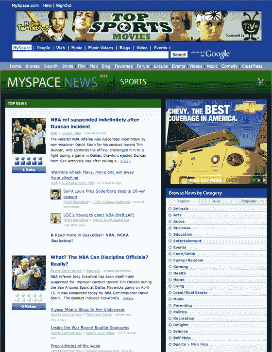
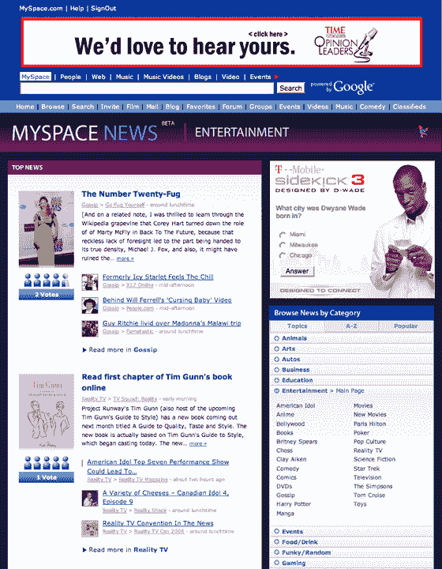

# 独家:MySpace 新闻周四发布 

> 原文：<https://web.archive.org/web/http://www.techcrunch.com:80/2007/04/18/exclusive-myspace-news-launches-tomorrow/>

# 独家:MySpace 新闻周四发布

周四上午，MySpace 将在 news.myspace.com发布其[传闻已久的](https://web.archive.org/web/20221130213022/http://www.beta.techcrunch.com/2007/03/09/it-looks-like-myspace-will-finally-do-something-with-newroo/)新闻资产。预计网站将上线，新闻稿将在美国东部时间早上 7 点左右发布。

新闻资产是建立在 Newroo 科技的基础上的，该公司在 2006 年初被传言以 700 万美元收购。Newroo 拥有有趣的技术，但在推出之前就被收购了。

今晚，我与 Newroo 创始人(以及 Myspace/Fox 的现任员工)布莱恩·诺加德(Brian Norgard)和丹·古尔德(Dan Gould)以及福克斯互动实验室(Fox Interactive Labs)负责人丹·斯特劳斯(Dan Strauss)就新房产进行了交谈。像谷歌新闻一样，MySpace 新闻将通过他们的 RSS 源从许多可靠的来源获取新闻。新闻条目将被分为 25 个主要类别和 300 个子类别，包括体育、政治、时尚和科技。考虑到新闻的新鲜度，新闻条目的顺序将由用户投票决定。用户可以对每条新闻进行投票，排名 1-5。高排名和高投票项目将出现在每个类别的顶部。

今后，我们可能会期望用户能够直接提交新闻条目。

下面的屏幕截图。

